# EEG Eye State Classification — Complete Analysis Report

---

**Dataset Source:** [UCI Machine Learning Repository — EEG Eye State](https://archive.ics.uci.edu/dataset/264/eeg+eye+state)

---

## Table of Contents

1. [Data Description Overview](#1-data-description-overview)
   - 1.1 [Dataset Citation & Source](#11-dataset-citation--source)
   - 1.2 [Dataset Loading](#12-dataset-loading)
   - 1.3 [Variable Classification & Electrode Positions](#13-variable-classification--electrode-positions)
   - 1.4 [Basic Statistics](#14-basic-statistics)
   - 1.5 [Class Distribution](#15-class-distribution)
2. [Data Imputation](#2-data-imputation)
3. [Data Visualization (Raw Data)](#3-data-visualization-raw-data)
   - 3.1 [Class Balance](#31-class-balance)
   - 3.2 [Correlation Heatmap](#32-correlation-heatmap)
   - 3.3 [Box Plots](#33-box-plots)
   - 3.4 [Histograms](#34-histograms)
4. [Signal Preprocessing (IQR → Bandpass)](#4-signal-preprocessing)
   - 4.1 [IQR Spike Removal (first)](#41-iqr-spike-removal-applied-first-before-filtering)
   - 4.2 [Bandpass Filter 0.5–45 Hz (second)](#42-bandpass-filter-0545-hz--applied-after-spike-removal)
5. [Data Visualization (After Preprocessing)](#5-data-visualization-after-preprocessing)
   - 5.1 [Corrected Correlation Heatmap](#51-corrected-correlation-heatmap-after-preprocessing)
   - 5.2 [Box Plots Comparison](#52-box-plots-comparison)
   - 5.3 [Histograms After Cleaning](#53-histograms-after-cleaning)
6. [PSD and Spectrogram Analysis](#6-psd-and-spectrogram-analysis)
   - 6.1 [Power Spectral Density (PSD)](#61-power-spectral-density-psd)
   - 6.2 [Spectrogram Analysis](#62-spectrogram-analysis)
7. [Dimensionality Reduction (LDA)](#7-dimensionality-reduction-lda)
8. [Machine Learning Classification](#8-machine-learning-classification)
   - 8.1 [Temporal Concept Drift Diagnosis](#81-temporal-concept-drift-diagnosis)
   - 8.2 [Split Configurations](#82-split-configurations)
   - 8.3 [Cross-Validation Results](#83-cross-validation-results)
   - 8.4 [Hold-Out Split Results](#84-hold-out-split-results)
   - 8.5 [Walk-Forward CV](#85-walk-forward-cv)
9. [Deep Learning Classification](#9-deep-learning-classification)
   - 9.0 [Architecture Overview & Training Setup](#90-architecture-overview--training-setup)
   - 9.1 [LSTM Classifier](#91-lstm-classifier)
   - 9.2 [CNN-LSTM Hybrid](#92-cnn-lstm-hybrid)
   - 9.3 [EEGNet (Lawhern 2018)](#93-eegnet-lawhern-2018)
   - 9.4 [Soft-Vote Ensemble](#94-soft-vote-ensemble)
   - 9.5 [DL Model Comparison](#95-dl-model-comparison)
10. [Final Comparison and Inference](#10-final-comparison-and-inference)
    - 10.1 [Unified Model Comparison](#101-unified-model-comparison)
    - 10.2 [Inference and Recommendation](#102-inference-and-recommendation)

---

# 1. Data Description Overview

## 1.1 Dataset Citation & Source

**Source:** [UCI Machine Learning Repository — EEG Eye State](https://archive.ics.uci.edu/dataset/264/eeg+eye+state)

> All data is from one continuous EEG measurement with the Emotiv EEG Neuroheadset. The duration of the measurement was 117 seconds. The eye state was detected via a camera during the EEG measurement and added later manually to the file after analysing the video frames. '1' indicates the eye-closed and '0' the eye-open state. All values are in chronological order with the first measured value at the top of the data.

## 1.2 Dataset Loading

The dataset is loaded from `dataset/eeg_data_og.csv`.

| Property | Value |
| --- | --- |
| Samples | 14980 |
| Features | 14 |
| Target Column | eyeDetection |
| Sampling Rate | 128 Hz |
| Recording Duration | 117.0 seconds |

## 1.3 Variable Classification & Electrode Positions

**Numerical Variables (Continuous):** 14 EEG electrode channels recording voltage in micro-volts (µV). The Emotiv EPOC headset uses a modified 10-20 international system for electrode placement.

| Electrode | Type | 10-20 Position | Brain Region | Functional Significance |
| --- | --- | --- | --- | --- |
| AF3 | Continuous (float64) | Anterior Frontal Left | Prefrontal Cortex | Executive function, attention |
| F7 | Continuous (float64) | Frontal Left Lateral | Left Temporal-Frontal | Language processing |
| F3 | Continuous (float64) | Frontal Left | Left Frontal Lobe | Motor planning, positive affect |
| FC5 | Continuous (float64) | Fronto-Central Left | Left Motor-Frontal | Motor preparation |
| T7 | Continuous (float64) | Temporal Left | Left Temporal Lobe | Auditory processing, memory |
| P7 | Continuous (float64) | Parietal Left | Left Parietal-Temporal | Visual-spatial processing |
| O1 | Continuous (float64) | Occipital Left | Left Visual Cortex | Visual processing |
| O2 | Continuous (float64) | Occipital Right | Right Visual Cortex | Visual processing |
| P8 | Continuous (float64) | Parietal Right | Right Parietal-Temporal | Spatial attention |
| T8 | Continuous (float64) | Temporal Right | Right Temporal Lobe | Face / emotion recognition |
| FC6 | Continuous (float64) | Fronto-Central Right | Right Motor-Frontal | Motor preparation |
| F4 | Continuous (float64) | Frontal Right | Right Frontal Lobe | Motor planning, negative affect |
| F8 | Continuous (float64) | Frontal Right Lateral | Right Temporal-Frontal | Emotion, social cognition |
| AF4 | Continuous (float64) | Anterior Frontal Right | Prefrontal Cortex | Executive function, attention |

**Categorical Variable (Target):**

| Variable | Type | Values | Description |
| --- | --- | --- | --- |
| eyeDetection | Binary (int) | 0 = Open, 1 = Closed | Eye state detected via camera during recording |

## 1.4 Basic Statistics

Descriptive statistics for all 14 EEG channels (µV).

| Channel | Count | Mean | Std | Min | 25% | 50% | 75% | Max |
| --- | --- | --- | --- | --- | --- | --- | --- | --- |
| AF3 | 14980 | 4321.92 | 2492.07 | 1030.77 | 4280.51 | 4294.36 | 4311.79 | 309231.00 |
| F7 | 14980 | 4009.77 | 45.94 | 2830.77 | 3990.77 | 4005.64 | 4023.08 | 7804.62 |
| F3 | 14980 | 4264.02 | 44.43 | 1040.00 | 4250.26 | 4262.56 | 4270.77 | 6880.51 |
| FC5 | 14980 | 4164.95 | 5216.40 | 2453.33 | 4108.21 | 4120.51 | 4132.31 | 642564.00 |
| T7 | 14980 | 4341.74 | 34.74 | 2089.74 | 4331.79 | 4338.97 | 4347.18 | 6474.36 |
| P7 | 14980 | 4644.02 | 2924.79 | 2768.21 | 4611.79 | 4617.95 | 4626.67 | 362564.00 |
| O1 | 14980 | 4110.40 | 4600.93 | 2086.15 | 4057.95 | 4070.26 | 4083.59 | 567179.00 |
| O2 | 14980 | 4616.06 | 29.29 | 4567.18 | 4604.62 | 4613.33 | 4624.10 | 7264.10 |
| P8 | 14980 | 4218.83 | 2136.41 | 1357.95 | 4190.77 | 4199.49 | 4209.23 | 265641.00 |
| T8 | 14980 | 4231.32 | 38.05 | 1816.41 | 4220.51 | 4229.23 | 4239.49 | 6674.36 |
| FC6 | 14980 | 4202.46 | 37.79 | 3273.33 | 4190.26 | 4200.51 | 4211.28 | 6823.08 |
| F4 | 14980 | 4279.23 | 41.54 | 2257.95 | 4267.69 | 4276.92 | 4287.18 | 7002.56 |
| F8 | 14980 | 4615.21 | 1208.37 | 86.67 | 4590.77 | 4603.08 | 4617.44 | 152308.00 |
| AF4 | 14980 | 4416.44 | 5891.29 | 1366.15 | 4342.05 | 4354.87 | 4372.82 | 715897.00 |

> **Note on Spike Artifacts:** Some channels exhibit extremely large max values — orders of magnitude above the 75th percentile. These are likely **electrode spike artifacts** caused by momentary loss of contact, muscle movement, or impedance changes in the Emotiv headset. These will be addressed by outlier removal.

## 1.5 Class Distribution

Distribution of the target variable `eyeDetection` (per UCI: 0 = open, 1 = closed).

| Eye State | Count | Percentage |
| --- | --- | --- |
| Open (0) | 8257 | 55.1% |
| Closed (1) | 6723 | 44.9% |

# 2. Data Imputation

Missing values are detected and filled using column-wise **median imputation** to preserve the statistical properties of each EEG channel.

**Result:** No missing values detected across any of the 14 EEG channels. The dataset is complete.

# 3. Data Visualization (Raw Data)

Visualizations of the raw EEG data before any preprocessing.

## 3.1 Class Balance

## 3.2 Correlation Heatmap

The correlation heatmap reveals linear relationships between EEG channels. Computed on data **winsorized at the 1st–99th percentile** to suppress spike-artifact-driven artificial correlations.

## 3.3 Box Plots

Box plots highlight potential outliers beyond the 1.5x IQR whiskers.

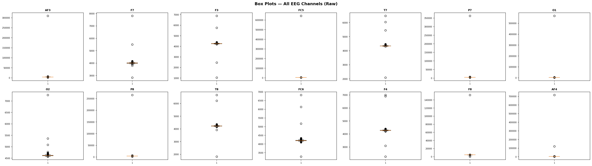

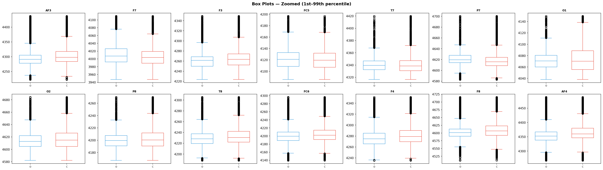

## 3.4 Histograms

Amplitude distributions per channel split by eye state.

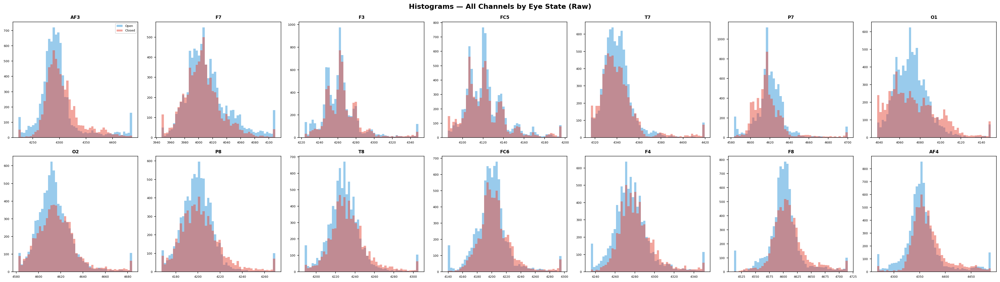

# 4. Signal Preprocessing

EEG signals contain artifacts from eye blinks, muscle movement, and electrode drift that must be removed before analysis. This section applies a two-stage cleaning pipeline in the **correct causal order**:

1. **IQR spike removal first** — raw hardware spike artifacts (up to 715,897 µV) are removed *before* filtering. Applying `filtfilt` to spikes first smears them to neighbouring samples via the backward pass, inflating data loss from ~9% to ~19%.

2. **Bandpass filter (0.5–45 Hz) second** — applied to the already spike-free signal so no artifact energy is convolved into the physiological EEG bands.

## 4.1 IQR Spike Removal (applied first, before filtering)

A **light IQR filter** (3.0x IQR, max 3 passes) removes hardware spike artifacts from the **raw** signal. Applying this step *before* filtering is critical: `filtfilt` convolves forward then backward, so a single spike at sample $t$ would contaminate samples $t - N$ through $t + N$ after filtering.

| Channel | Lower Bound (µV) | Upper Bound (µV) |
| --- | --- | --- |
| AF3 | 4186.67 | 4405.63 |
| F7 | 3897.95 | 4113.34 |
| F3 | 4193.35 | 4326.14 |
| FC5 | 4047.69 | 4187.69 |
| T7 | 4288.71 | 4389.23 |
| P7 | 4570.24 | 4667.19 |
| O1 | 3982.08 | 4157.92 |
| O2 | 4549.24 | 4678.46 |
| P8 | 4138.45 | 4260.53 |
| T8 | 4164.62 | 4293.84 |
| FC6 | 4127.70 | 4271.27 |
| F4 | 4213.33 | 4338.98 |
| F8 | 4517.41 | 4686.18 |
| AF4 | 4260.00 | 4450.26 |

| Metric | Value |
| --- | --- |
| Original samples | 14980 |
| After IQR removal | 13606 |
| Spike samples removed | 1374 |
| Removal % | 9.2% |
| IQR passes | 3 |
| IQR multiplier | 3.0x |

## 4.2 Bandpass Filter (0.5–45 Hz) — applied after spike removal

A 4th-order Butterworth bandpass filter (0.5–45.0 Hz) removes DC drift and high-frequency noise while preserving physiologically relevant EEG bands (Delta through Gamma). Applied via `scipy.signal.filtfilt` (zero-phase, forward-backward filtering) to avoid phase distortion.

$$|H(j\omega)|^2 = \frac{1}{1 + \left(\frac{\omega^2 - \omega_0^2}{\omega_c}\right)^{2N}}$$

where $\omega_0 = \sqrt{\omega_L \cdot \omega_H}$ and $N$ = 4 is the filter order.

| Metric | Value |
| --- | --- |
| Original samples | 14980 |
| After IQR spike removal | 13606 |
| After bandpass filter | 13606 |
| Total removed | 1374 |
| Total removal % | 9.2% |
| Bandpass range | 0.5–45.0 Hz |
| Filter order | 4 |

> **Preprocessing Summary (corrected order):** IQR spike removal (3.0×, 9.2% removed) → Bandpass filter (0.5–45.0 Hz). Total retained: **13606 / 14980 samples (90.8%)**.

# 5. Data Visualization (After Preprocessing)

Comparison of distributions before and after preprocessing.

## 5.1 Corrected Correlation Heatmap (after preprocessing)

With spike artifacts removed, the correlation heatmap now reflects true physiological relationships between EEG channels.

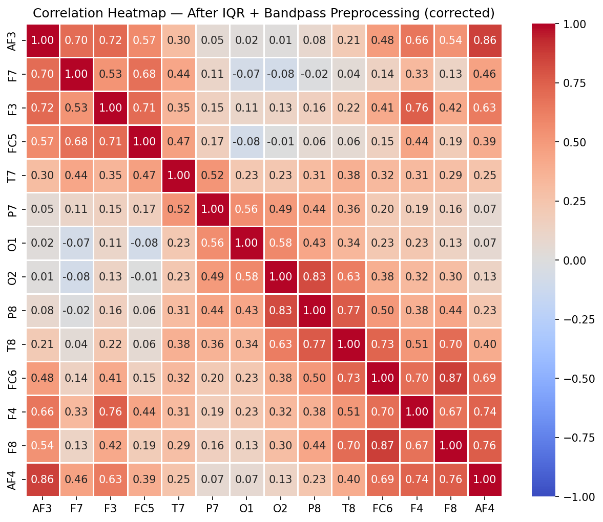

## 5.2 Box Plots Comparison

Side-by-side box plots confirm preprocessing effectiveness. Whiskers are set to 3.0x IQR to match the cleaning threshold.

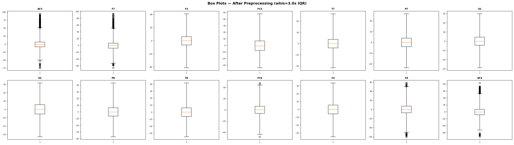

## 5.3 Histograms After Cleaning

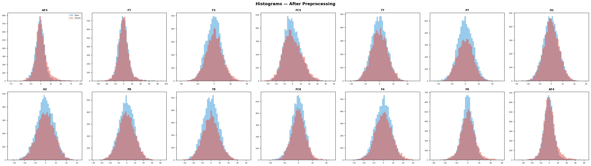

# 6. PSD and Spectrogram Analysis

Frequency-domain analysis reveals the power distribution across brain wave bands: **Delta** (0.5-4 Hz), **Theta** (4-8 Hz), **Alpha** (8-12 Hz), **Beta** (12-30 Hz), and **Gamma** (30-45 Hz). Alpha power increases when eyes are closed (the **Berger effect**).

## 6.1 Power Spectral Density (PSD)

Welch's method estimates the PSD for each channel using segment averaging (Hann window, `nperseg=256`, 50% overlap). Shaded regions indicate standard EEG frequency bands.

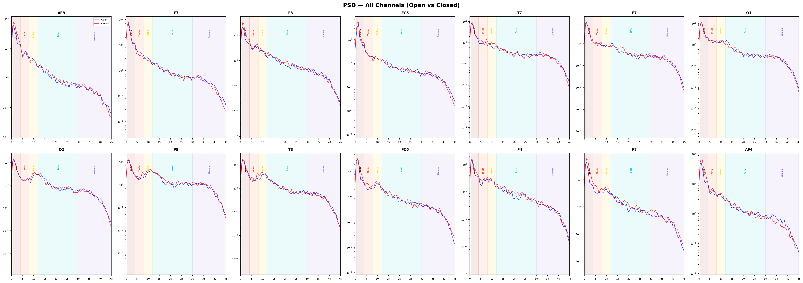

**PSD Interpretation — Berger Effect:** Alpha-band power (8–12 Hz) increases when the eyes are closed, particularly in occipital electrodes (O1, O2). If the red curve (closed) shows higher power in the alpha band compared to blue (open), this confirms the dataset captures genuine physiological differences between eye states.

## 6.2 Spectrogram Analysis

Spectrograms show the time-frequency power distribution. Horizontal dashed lines mark band boundaries.

# 7. Dimensionality Reduction (LDA)

LDA (Linear Discriminant Analysis) maximises the ratio of between-class to within-class variance, yielding the optimal single linear discriminant for binary classification. Applied to the raw 14-channel feature space.

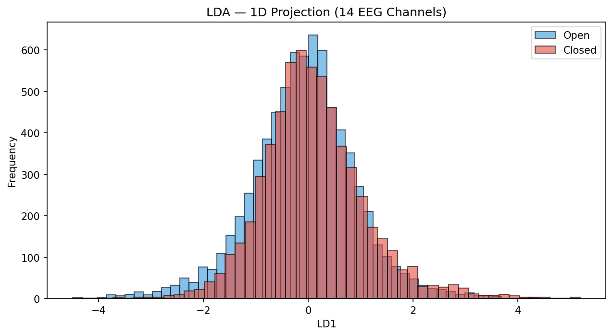

| Metric | Value | Interpretation |
| --- | --- | --- |
| Silhouette Score | 0.0022 | Higher = better separation (max 1.0) |
| Davies-Bouldin Index | 7.8939 | Lower = better separation |
| Calinski-Harabasz Score | 121.56 | Higher = better separation |

**Interpretation:** LDA silhouette of 0.002 confirms that eye states are not trivially separable in the raw amplitude space. The near-complete overlap in the 1D projection means that **instantaneous EEG voltage alone cannot distinguish open from closed eyes**. The discriminative signal lives in two places:

1. **Temporal dynamics** — how voltages change over time (alpha oscillations at 8–12 Hz require at least ~125ms / 16 samples to observe one full cycle)
2. **Frequency-domain structure** — the Berger effect (alpha power increase during eye closure) confirmed by PSD analysis in Section 6

This directly motivates the DL architecture choices in Section 9: EEGNet's temporal convolution kernel spans ~250ms (32 samples) to capture alpha rhythm, while LSTM/CNN-LSTM process 64-sample windows (~500ms) to accumulate sufficient temporal context. ML models (Section 8) operating on single-sample features are expected to perform worse — and they do.

# 8. Machine Learning Classification

The ML pipeline uses **raw 14 EEG channels** with temporal (chronological) splits to evaluate classification under realistic deployment conditions. Key design choices:

- **No shuffling**: all splits are chronological to prevent data leakage
- **Class weighting**: `class_weight='balanced'` (LogReg, RF) and `scale_pos_weight` (XGBoost) compensate for temporal class drift
- **Threshold optimization**: CV-optimised decision threshold applied consistently to both CV and test partitions
- **Primary metric: Macro-F1** — equally weights both eye states under distribution shift

**Models selected:** LogisticRegression (well-calibrated baseline), RandomForest (robust nonlinear), XGBoost (best gradient boosting with native imbalance handling). GradientBoosting and SVM are excluded — GB lacks `class_weight` support, and SVM is prohibitively slow with no accuracy advantage.

## 8.1 Temporal Concept Drift Diagnosis

The subject's eye-state distribution changes dramatically over the recording. Every hold-out split places the test window in the heavily open-dominant tail.

| Segment | Open | Closed | % Closed |
| --- | --- | --- | --- |
| Q1 [0–3401] | 1707 | 1694 | 49.8% |
| Q2 [3401–6803] | 1374 | 2028 | 59.6% |
| Q3 [6803–10204] | 1780 | 1621 | 47.7% |
| Q4 [10204–13606] | 2579 | 823 | 24.2% |
| Last 10% | 1309 | 52 | 3.8% |
| Last 15% | 1937 | 104 | 5.1% |
| Last 20% | 2579 | 143 | 5.3% |

> **Warning:** The last 15% of the recording is only ~8% closed-eye. Models trained on balanced data (~50% closed) face a ~45% distribution shift. Accuracy is misleading — **Macro-F1 is the honest metric**.

## 8.2 Split Configurations

| Split | Train N | CV N | Test N | Train Closed% | CV Closed% | Test Closed% | Δ Shift |
| --- | --- | --- | --- | --- | --- | --- | --- |
| 70/15/15 | 9524 | 2041 | 2041 | 56.0% | 35.9% | 5.1% | 50.9% |
| 60/20/20 | 8163 | 2721 | 2722 | 62.3% | 34.6% | 5.3% | 57.0% |
| 80/10/10 | 10884 | 1361 | 1361 | 55.3% | 6.7% | 3.8% | 51.5% |

## 8.3 Cross-Validation Results (5-Fold TimeSeriesSplit)

5-fold time-series CV on the 70/15 training portion. Each fold trains on all preceding data, respecting temporal order.

| Model | CV Macro-F1 Mean | CV Macro-F1 Std |
| --- | --- | --- |
| LogisticRegression | 0.4653 | 0.0705 |
| RandomForest | 0.4222 | 0.0518 |
| XGBoost | 0.4511 | 0.0617 |

## 8.4 Hold-Out Split Results

### Split 70/15/15

Train=9524 (56.0% closed) | CV=2041 (35.9% closed) | Test=2041 (5.1% closed) | Δ shift=50.9%

**LogisticRegression:** Logistic Regression models the posterior probability:

$$P(y=1 \mid \mathbf{x}) = \sigma(\mathbf{w}^T \mathbf{x} + b) = \frac{1}{1 + e^{-(\mathbf{w}^T \mathbf{x} + b)}}$$

Uses `class_weight='balanced'` to penalise minority-class misclassification.

Acc=0.7423 | MacroF1=0.4540 | BinaryF1=0.0573 | AUC=0.3627 | Threshold=0.53 | TrainTime=0.0s

|  | Pred Open | Pred Closed |
| --- | --- | --- |
| True Open | 1499 | 438 |
| True Closed | 88 | 16 |

TP=16  FP=438  FN=88  TN=1499

**RandomForest:** Random Forest builds 200 decision trees, each trained on a bootstrapped subset:

$$\hat{y} = \text{mode}\{h_b(\mathbf{x})\}_{b=1}^{200}$$

Uses `class_weight='balanced'` and splits by Gini impurity.

Acc=0.6164 | MacroF1=0.4009 | BinaryF1=0.0416 | AUC=0.3984 | Threshold=0.61 | TrainTime=2.0s

|  | Pred Open | Pred Closed |
| --- | --- | --- |
| True Open | 1241 | 696 |
| True Closed | 87 | 17 |

TP=17  FP=696  FN=87  TN=1241

**XGBoost:** XGBoost uses `scale_pos_weight = n_neg / n_pos` (computed from **training data only**) to handle class imbalance directly in the gradient computation.

Acc=0.6629 | MacroF1=0.4310 | BinaryF1=0.0678 | AUC=0.4155 | Threshold=0.72 | TrainTime=0.5s

|  | Pred Open | Pred Closed |
| --- | --- | --- |
| True Open | 1328 | 609 |
| True Closed | 79 | 25 |

TP=25  FP=609  FN=79  TN=1328

**70/15/15 — ML Test Summary (ranked by Macro-F1):**

| Model | Acc | MacroF1 | Prec(M) | Rec(M) | AUC | Thresh |
| --- | --- | --- | --- | --- | --- | --- |
| LogisticRegression | 0.7423 | 0.4540 | 0.4899 | 0.4639 | 0.3627 | 0.53 |
| XGBoost | 0.6629 | 0.4310 | 0.4916 | 0.4630 | 0.4155 | 0.72 |
| RandomForest | 0.6164 | 0.4009 | 0.4792 | 0.4021 | 0.3984 | 0.61 |

### Split 60/20/20

Train=8163 (62.3% closed) | CV=2721 (34.6% closed) | Test=2722 (5.3% closed) | Δ shift=57.0%

Acc=0.7439 | MacroF1=0.4812 | BinaryF1=0.1121 | AUC=0.4831 | Threshold=0.54 | TrainTime=0.0s

|  | Pred Open | Pred Closed |
| --- | --- | --- |
| True Open | 1981 | 598 |
| True Closed | 99 | 44 |

TP=44  FP=598  FN=99  TN=1981

Acc=0.6323 | MacroF1=0.4271 | BinaryF1=0.0842 | AUC=0.4515 | Threshold=0.68 | TrainTime=1.7s

|  | Pred Open | Pred Closed |
| --- | --- | --- |
| True Open | 1675 | 904 |
| True Closed | 97 | 46 |

TP=46  FP=904  FN=97  TN=1675

Acc=0.6462 | MacroF1=0.4355 | BinaryF1=0.0907 | AUC=0.4896 | Threshold=0.79 | TrainTime=0.5s

|  | Pred Open | Pred Closed |
| --- | --- | --- |
| True Open | 1711 | 868 |
| True Closed | 95 | 48 |

TP=48  FP=868  FN=95  TN=1711

**60/20/20 — ML Test Summary (ranked by Macro-F1):**

| Model | Acc | MacroF1 | Prec(M) | Rec(M) | AUC | Thresh |
| --- | --- | --- | --- | --- | --- | --- |
| LogisticRegression | 0.7439 | 0.4812 | 0.5105 | 0.5379 | 0.4831 | 0.54 |
| XGBoost | 0.6462 | 0.4355 | 0.4999 | 0.4995 | 0.4896 | 0.79 |
| RandomForest | 0.6323 | 0.4271 | 0.4968 | 0.4856 | 0.4515 | 0.68 |

### Split 80/10/10

Train=10884 (55.3% closed) | CV=1361 (6.7% closed) | Test=1361 (3.8% closed) | Δ shift=51.5%

Acc=0.8663 | MacroF1=0.4642 | BinaryF1=0.0000 | AUC=0.2041 | Threshold=0.56 | TrainTime=0.0s

|  | Pred Open | Pred Closed |
| --- | --- | --- |
| True Open | 1179 | 130 |
| True Closed | 52 | 0 |

TP=0  FP=130  FN=52  TN=1179

Acc=0.9030 | MacroF1=0.5030 | BinaryF1=0.0571 | AUC=0.3742 | Threshold=0.73 | TrainTime=2.3s

|  | Pred Open | Pred Closed |
| --- | --- | --- |
| True Open | 1225 | 84 |
| True Closed | 48 | 4 |

TP=4  FP=84  FN=48  TN=1225

Acc=0.9295 | MacroF1=0.5201 | BinaryF1=0.0769 | AUC=0.4156 | Threshold=0.95 | TrainTime=0.5s

|  | Pred Open | Pred Closed |
| --- | --- | --- |
| True Open | 1261 | 48 |
| True Closed | 48 | 4 |

TP=4  FP=48  FN=48  TN=1261

**80/10/10 — ML Test Summary (ranked by Macro-F1):**

| Model | Acc | MacroF1 | Prec(M) | Rec(M) | AUC | Thresh |
| --- | --- | --- | --- | --- | --- | --- |
| XGBoost | 0.9295 | 0.5201 | 0.5201 | 0.5201 | 0.4156 | 0.95 |
| RandomForest | 0.9030 | 0.5030 | 0.5039 | 0.5064 | 0.3742 | 0.73 |
| LogisticRegression | 0.8663 | 0.4642 | 0.4789 | 0.4503 | 0.2041 | 0.56 |

## 8.5 Walk-Forward CV (Expanding Window) — 5 Folds

Expanding-window walk-forward CV simulates real deployment: the model always trains on all available past data before predicting the next window. A fixed threshold of 0.5 is used for unbiased evaluation.

Fold 1 — train=6803 | val=1133 | val_closed=100.00%

  LogisticRegression: Acc=0.5128 MacroF1=0.3390 AUC=nan

  RandomForest: Acc=0.6628 MacroF1=0.3986 AUC=nan

  XGBoost: Acc=0.5631 MacroF1=0.3602 AUC=nan

Fold 2 — train=7936 | val=1133 | val_closed=41.92%

  LogisticRegression: Acc=0.5022 MacroF1=0.5004 AUC=0.5059

  RandomForest: Acc=0.4978 MacroF1=0.4685 AUC=0.5905

  XGBoost: Acc=0.5234 MacroF1=0.5229 AUC=0.5772

Fold 3 — train=9069 | val=1133 | val_closed=0.97%

  LogisticRegression: Acc=0.5199 MacroF1=0.3594 AUC=0.9927

  RandomForest: Acc=0.2577 MacroF1=0.2130 AUC=0.9952

  XGBoost: Acc=0.4228 MacroF1=0.3106 AUC=0.9843

Fold 4 — train=10202 | val=1133 | val_closed=60.19%

  LogisticRegression: Acc=0.4810 MacroF1=0.4711 AUC=0.4801

  RandomForest: Acc=0.5375 MacroF1=0.5128 AUC=0.4911

  XGBoost: Acc=0.5172 MacroF1=0.5023 AUC=0.5057

Fold 5 — train=11335 | val=1133 | val_closed=8.03%

  LogisticRegression: Acc=0.5322 MacroF1=0.4294 AUC=0.6395

  RandomForest: Acc=0.3883 MacroF1=0.3353 AUC=0.5356

  XGBoost: Acc=0.4484 MacroF1=0.3671 AUC=0.4961

**Walk-Forward CV — Mean ± Std (primary: Macro-F1):**

| Model | MacroF1 Mean±Std | Acc Mean±Std | AUC Mean±Std |
| --- | --- | --- | --- |
| LogisticRegression | 0.4199±0.0623 | 0.5096±0.0173 | 0.5236±0.3193 |
| RandomForest | 0.3857±0.1054 | 0.4688±0.1373 | 0.5225±0.3169 |
| XGBoost | 0.4126±0.0842 | 0.4950±0.0516 | 0.5127±0.3130 |

**Stability observation:** LogisticRegression has the lowest Macro-F1 variance (±0.0623) across folds, confirming it transfers most reliably across different temporal regimes. This supports its recommendation as the stable production model in Section 10.

**Feature Importance (RandomForest — 70/15/15 training partition):**

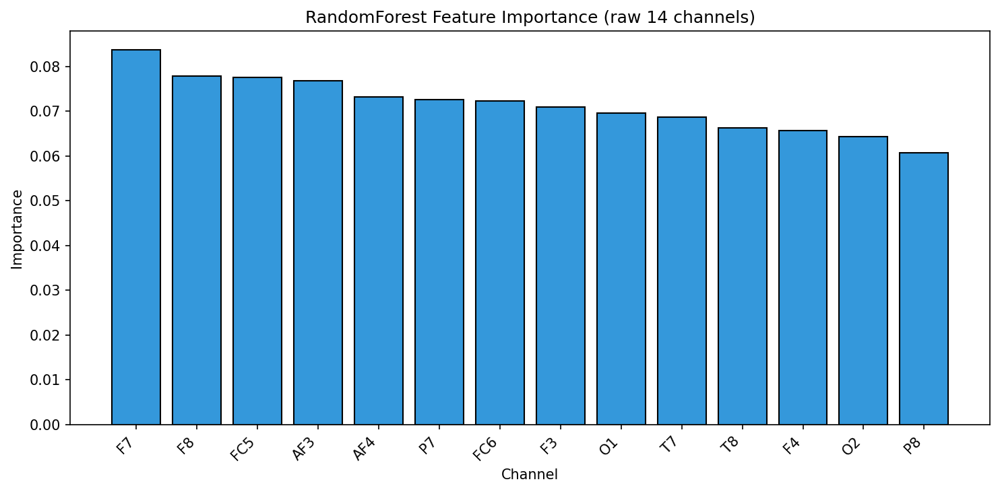

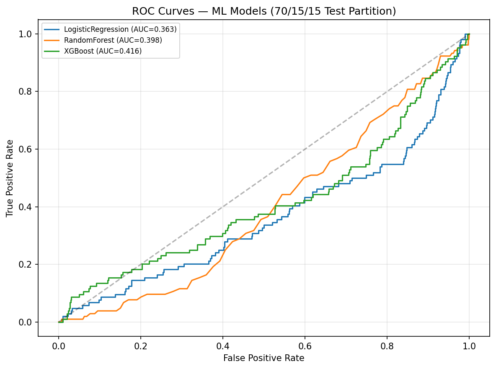

> **Note on AUC < 0.5:** ROC curves below the diagonal are **not** a model error — they are an expected artifact of **concept drift**. The test partition (last 15%) has only ~5% closed-eye samples vs ~56% in training. The model's learned probability calibration inverts under this ~45% distribution shift: patterns that predicted 'closed' during training now appear in 'open' segments. This is why **Macro-F1 with CV-optimised threshold** is the primary metric — threshold tuning partially compensates for the shifted decision boundary, whereas raw AUC cannot.

# 9. Deep Learning Classification

All DL models use PyTorch with: **(1) weighted CrossEntropyLoss** (inverse class frequency), **(2) AdamW + CosineAnnealingLR**, **(3) CV-optimised decision threshold**, and **(4) Macro-F1 as primary metric**. Sequences are built per partition with no cross-boundary leakage. Label = last sample in window (not look-ahead).

**Models selected:** LSTM (temporal baseline), CNN-LSTM (local+temporal), EEGNet (EEG-specific, ~1.1K params). EEGTransformer and PatchTST are excluded — they suffer mode collapse on this dataset size (~14K samples).

## 9.0 Architecture Overview & Training Setup

**Weighted Cross-Entropy Loss:**

$$\mathcal{L} = -\frac{1}{N}\sum_{i=1}^{N} w_{y_i} \log\left(\frac{e^{z_{y_i}}}{\sum_{c=0}^{1} e^{z_c}}\right)$$

where $w_c = \frac{N}{2 \cdot N_c}$ is the per-class weight. **Sequence length:** SEQ_LEN=64 samples (≈500ms at 128 Hz). **Optimizer:** AdamW, lr=1e-3, weight_decay=1e-4. **Scheduler:** CosineAnnealingLR over 25 epochs.

| Model | Architecture | Parameters | Key Innovation |
| --- | --- | --- | --- |
| LSTM | BiLSTM(128)×2 → AvgPool → MLP | ~200K | Long-range temporal dependencies |
| CNN-LSTM | Conv1D(64,128) → BiLSTM(64) → MLP | ~150K | Local feature extraction + sequence memory |
| EEGNet | Depthwise Conv2D blocks → Linear | ~1.1K | Electrode-aware, compact, best calibrated |

### Split 70/15/15

Train=9524 (56.0% closed) | CV=2041 (35.9% closed) | Test=2041 (5.1% closed)

## 9.1 LSTM

Stacked bidirectional LSTM captures long-range temporal dependencies.

$$c_t = f_t \odot c_{t-1} + i_t \odot \tilde{c}_t, \quad h_t = o_t \odot \tanh(c_t)$$

| Epoch | Train Loss | CV Loss | CV Macro-F1 |
| --- | --- | --- | --- |
| 5 | 0.0381 | 3.4612 | 0.5646 |
| 10 | 0.0064 | 5.3600 | 0.5559 |
| 15 | — | — | — (stopped) |
| 20 | — | — | — (stopped) |
| 25 | — | — | — (stopped) |

**Early stopping:** best checkpoint at epoch 1 (CV loss = 1.1141). Training stopped early at epoch 10 (patience=7).

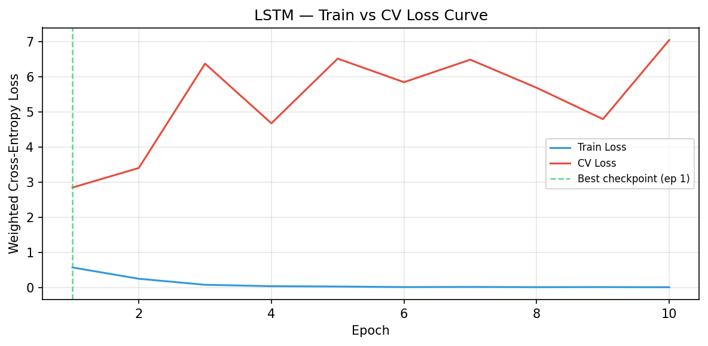

Optimal threshold (CV-optimised): **0.60**

| Partition | Acc | MacroF1 | BinaryF1 | Prec(M) | Rec(M) | AUC |
| --- | --- | --- | --- | --- | --- | --- |
| CV | 0.6158 | 0.5680 | 0.4242 | 0.5755 | 0.5677 | 0.5547 |
| Test | 0.7331 | 0.4248 | 0.0038 | 0.4680 | 0.3914 | 0.3742 |

**Test Confusion Matrix:**

|  | Pred Open | Pred Closed |
| --- | --- | --- |
| True Open | 1449 | 425 |
| True Closed | 103 | 1 |

TP=1  FP=425  FN=103  TN=1449

## 9.2 CNN_LSTM

Two 1D convolutional blocks extract local temporal features; a bidirectional LSTM then models sequence dynamics.

$$y_t^{(f)} = \text{ReLU}\left(\sum_{k,c} w_{k,c}^{(f)} \cdot x_{t+k,c} + b^{(f)}\right)$$

| Epoch | Train Loss | CV Loss | CV Macro-F1 |
| --- | --- | --- | --- |
| 5 | 0.0127 | 2.2211 | 0.5999 |
| 10 | 0.0044 | 2.3519 | 0.5689 |
| 15 | — | — | — (stopped) |
| 20 | — | — | — (stopped) |
| 25 | — | — | — (stopped) |

**Early stopping:** best checkpoint at epoch 2 (CV loss = 1.2851). Training stopped early at epoch 10 (patience=7).

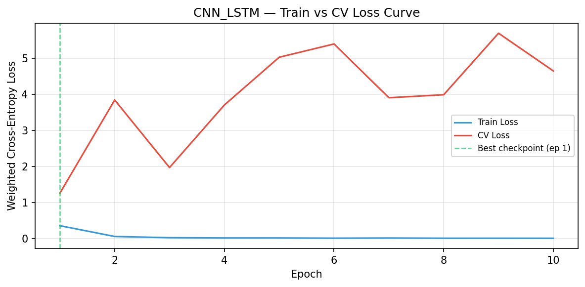

Optimal threshold (CV-optimised): **0.54**

| Partition | Acc | MacroF1 | BinaryF1 | Prec(M) | Rec(M) | AUC |
| --- | --- | --- | --- | --- | --- | --- |
| CV | 0.6471 | 0.6139 | 0.5007 | 0.6172 | 0.6123 | 0.6528 |
| Test | 0.7740 | 0.5043 | 0.1387 | 0.5216 | 0.5720 | 0.5687 |

**Test Confusion Matrix:**

|  | Pred Open | Pred Closed |
| --- | --- | --- |
| True Open | 1495 | 379 |
| True Closed | 68 | 36 |

TP=36  FP=379  FN=68  TN=1495

## 9.3 EEGNet

EEGNet (Lawhern et al. 2018) uses depthwise-separable 2D convolutions that explicitly model temporal patterns (Block 1 temporal kernel ≈ 250ms) and cross-electrode spatial patterns. Only ~1.1K parameters — highly resistant to overfitting on limited data.

| Epoch | Train Loss | CV Loss | CV Macro-F1 |
| --- | --- | --- | --- |
| 5 | 0.5284 | 0.7301 | 0.5397 |
| 10 | 0.3958 | 0.8396 | 0.5148 |
| 15 | — | — | — (stopped) |
| 20 | — | — | — (stopped) |
| 25 | — | — | — (stopped) |

**Early stopping:** best checkpoint at epoch 2 (CV loss = 0.6964). Training stopped early at epoch 10 (patience=7).

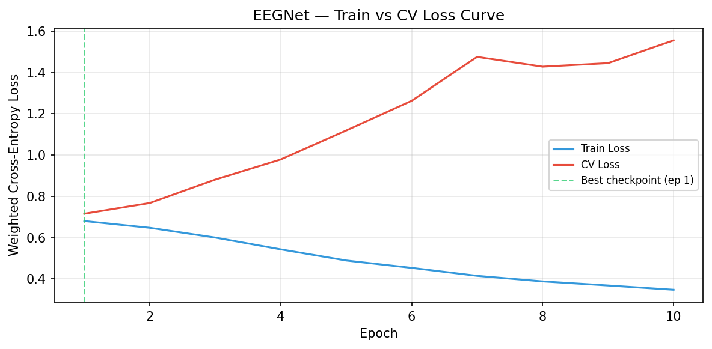

Optimal threshold (CV-optimised): **0.51**

| Partition | Acc | MacroF1 | BinaryF1 | Prec(M) | Rec(M) | AUC |
| --- | --- | --- | --- | --- | --- | --- |
| CV | 0.5394 | 0.5070 | 0.3807 | 0.5070 | 0.5071 | 0.5037 |
| Test | 0.6572 | 0.4648 | 0.1439 | 0.5232 | 0.6057 | 0.5444 |

**Test Confusion Matrix:**

|  | Pred Open | Pred Closed |
| --- | --- | --- |
| True Open | 1243 | 631 |
| True Closed | 47 | 57 |

TP=57  FP=631  FN=47  TN=1243

## 9.4 Soft-Vote Ensemble

**Soft-Vote Ensemble — 70/15/15**

Random-weight Dirichlet search with threshold co-optimization.

Optimal weights (CV Macro-F1 = 0.6291, threshold = 0.50):

| Model | Weight | Contribution |
| --- | --- | --- |
| EEGNet | 0.7274 | █████████████████████████ |
| CNN_LSTM | 0.2502 | ████████ |
| LSTM | 0.0224 | █ |

Ensemble Test (t=0.50): Acc=0.7558 | MacroF1=0.4764 | AUC=0.6428

|  | Pred Open | Pred Closed |
| --- | --- | --- |
| True Open | 1470 | 404 |
| True Closed | 79 | 25 |

TP=25  FP=404  FN=79  TN=1470

## 9.5 DL Model Comparison

**DL Model Comparison — 70/15/15:**

| Model | Acc | MacroF1 | Prec(M) | Rec(M) | AUC | Thresh |
| --- | --- | --- | --- | --- | --- | --- |
| CNN_LSTM | 0.7740 | 0.5043 | 0.5216 | 0.5720 | 0.5687 | 0.54 |
| Ensemble | 0.7558 | 0.4764 | 0.5036 | 0.5124 | 0.6428 | 0.50 |
| EEGNet | 0.6572 | 0.4648 | 0.5232 | 0.6057 | 0.5444 | 0.51 |
| LSTM | 0.7331 | 0.4248 | 0.4680 | 0.3914 | 0.3742 | 0.60 |

### Split 60/20/20

Train=8163 (62.3% closed) | CV=2721 (34.6% closed) | Test=2722 (5.3% closed)

| Epoch | Train Loss | CV Loss | CV Macro-F1 |
| --- | --- | --- | --- |
| 5 | 0.0224 | 5.2310 | 0.4983 |
| 10 | 0.0037 | 5.9780 | 0.5386 |
| 15 | — | — | — (stopped) |
| 20 | — | — | — (stopped) |
| 25 | — | — | — (stopped) |

**Early stopping:** best checkpoint at epoch 1 (CV loss = 0.9690). Training stopped early at epoch 10 (patience=7).

Optimal threshold (CV-optimised): **0.94**

| Partition | Acc | MacroF1 | BinaryF1 | Prec(M) | Rec(M) | AUC |
| --- | --- | --- | --- | --- | --- | --- |
| CV | 0.7540 | 0.6835 | 0.5342 | 0.7385 | 0.6711 | 0.6953 |
| Test | 0.7638 | 0.4859 | 0.1080 | 0.5088 | 0.5289 | 0.6867 |

**Test Confusion Matrix:**

|  | Pred Open | Pred Closed |
| --- | --- | --- |
| True Open | 1993 | 523 |
| True Closed | 105 | 38 |

TP=38  FP=523  FN=105  TN=1993

| Epoch | Train Loss | CV Loss | CV Macro-F1 |
| --- | --- | --- | --- |
| 5 | 0.0108 | 2.7915 | 0.5166 |
| 10 | 0.0048 | 2.8784 | 0.5794 |
| 15 | — | — | — (stopped) |
| 20 | — | — | — (stopped) |
| 25 | — | — | — (stopped) |

**Early stopping:** best checkpoint at epoch 1 (CV loss = 0.9994). Training stopped early at epoch 10 (patience=7).

Optimal threshold (CV-optimised): **0.86**

| Partition | Acc | MacroF1 | BinaryF1 | Prec(M) | Rec(M) | AUC |
| --- | --- | --- | --- | --- | --- | --- |
| CV | 0.6994 | 0.6665 | 0.5617 | 0.6641 | 0.6699 | 0.7237 |
| Test | 0.6412 | 0.4488 | 0.1232 | 0.5133 | 0.5598 | 0.5800 |

**Test Confusion Matrix:**

|  | Pred Open | Pred Closed |
| --- | --- | --- |
| True Open | 1638 | 878 |
| True Closed | 76 | 67 |

TP=67  FP=878  FN=76  TN=1638

| Epoch | Train Loss | CV Loss | CV Macro-F1 |
| --- | --- | --- | --- |
| 5 | 0.4768 | 0.5576 | 0.7028 |
| 10 | 0.2943 | 0.4565 | 0.7623 |
| 15 | 0.2277 | 0.4342 | 0.7875 |
| 20 | 0.1951 | 0.4679 | 0.7948 |
| 25 | 0.1981 | 0.4824 | 0.7935 |

**Early stopping:** best checkpoint at epoch 22 (CV loss = 0.4308). Full 25 epochs completed.

Optimal threshold (CV-optimised): **0.91**

| Partition | Acc | MacroF1 | BinaryF1 | Prec(M) | Rec(M) | AUC |
| --- | --- | --- | --- | --- | --- | --- |
| CV | 0.8488 | 0.8202 | 0.7484 | 0.8430 | 0.8063 | 0.9223 |
| Test | 0.6924 | 0.4963 | 0.1820 | 0.5387 | 0.6660 | 0.6554 |

**Test Confusion Matrix:**

|  | Pred Open | Pred Closed |
| --- | --- | --- |
| True Open | 1750 | 766 |
| True Closed | 52 | 91 |

TP=91  FP=766  FN=52  TN=1750

**Soft-Vote Ensemble — 60/20/20**

Random-weight Dirichlet search with threshold co-optimization.

Optimal weights (CV Macro-F1 = 0.8375, threshold = 0.60):

| Model | Weight | Contribution |
| --- | --- | --- |
| EEGNet | 0.5955 | █████████████████████████ |
| LSTM | 0.3276 | █████████████ |
| CNN_LSTM | 0.0769 | ███ |

Ensemble Test (t=0.60): Acc=0.4720 | MacroF1=0.3786 | AUC=0.7250

|  | Pred Open | Pred Closed |
| --- | --- | --- |
| True Open | 1143 | 1373 |
| True Closed | 31 | 112 |

TP=112  FP=1373  FN=31  TN=1143

**DL Model Comparison — 60/20/20:**

| Model | Acc | MacroF1 | Prec(M) | Rec(M) | AUC | Thresh |
| --- | --- | --- | --- | --- | --- | --- |
| EEGNet | 0.6924 | 0.4963 | 0.5387 | 0.6660 | 0.6554 | 0.91 |
| LSTM | 0.7638 | 0.4859 | 0.5088 | 0.5289 | 0.6867 | 0.94 |
| CNN_LSTM | 0.6412 | 0.4488 | 0.5133 | 0.5598 | 0.5800 | 0.86 |
| Ensemble | 0.4720 | 0.3786 | 0.5245 | 0.6188 | 0.7250 | 0.60 |

### Split 80/10/10

Train=10884 (55.3% closed) | CV=1361 (6.7% closed) | Test=1361 (3.8% closed)

| Epoch | Train Loss | CV Loss | CV Macro-F1 |
| --- | --- | --- | --- |
| 5 | 0.0262 | 6.5124 | 0.2942 |
| 10 | 0.0058 | 7.0407 | 0.3365 |
| 15 | — | — | — (stopped) |
| 20 | — | — | — (stopped) |
| 25 | — | — | — (stopped) |

**Early stopping:** best checkpoint at epoch 1 (CV loss = 2.8431). Training stopped early at epoch 10 (patience=7).

Optimal threshold (CV-optimised): **0.95**

| Partition | Acc | MacroF1 | BinaryF1 | Prec(M) | Rec(M) | AUC |
| --- | --- | --- | --- | --- | --- | --- |
| CV | 0.6371 | 0.4471 | 0.1229 | 0.5030 | 0.5102 | 0.3868 |
| Test | 0.7149 | 0.4169 | 0.0000 | 0.4735 | 0.3724 | 0.5724 |

**Test Confusion Matrix:**

|  | Pred Open | Pred Closed |
| --- | --- | --- |
| True Open | 928 | 318 |
| True Closed | 52 | 0 |

TP=0  FP=318  FN=52  TN=928

| Epoch | Train Loss | CV Loss | CV Macro-F1 |
| --- | --- | --- | --- |
| 5 | 0.0129 | 5.0309 | 0.2327 |
| 10 | 0.0047 | 4.6506 | 0.2934 |
| 15 | — | — | — (stopped) |
| 20 | — | — | — (stopped) |
| 25 | — | — | — (stopped) |

**Early stopping:** best checkpoint at epoch 1 (CV loss = 1.2543). Training stopped early at epoch 10 (patience=7).

Optimal threshold (CV-optimised): **0.95**

| Partition | Acc | MacroF1 | BinaryF1 | Prec(M) | Rec(M) | AUC |
| --- | --- | --- | --- | --- | --- | --- |
| CV | 0.7812 | 0.4855 | 0.0955 | 0.4983 | 0.4963 | 0.5110 |
| Test | 0.8128 | 0.4484 | 0.0000 | 0.4765 | 0.4234 | 0.5286 |

**Test Confusion Matrix:**

|  | Pred Open | Pred Closed |
| --- | --- | --- |
| True Open | 1055 | 191 |
| True Closed | 52 | 0 |

TP=0  FP=191  FN=52  TN=1055

| Epoch | Train Loss | CV Loss | CV Macro-F1 |
| --- | --- | --- | --- |
| 5 | 0.4894 | 1.1188 | 0.2969 |
| 10 | 0.3479 | 1.5549 | 0.2868 |
| 15 | — | — | — (stopped) |
| 20 | — | — | — (stopped) |
| 25 | — | — | — (stopped) |

**Early stopping:** best checkpoint at epoch 1 (CV loss = 0.7158). Training stopped early at epoch 10 (patience=7).

Optimal threshold (CV-optimised): **0.60**

| Partition | Acc | MacroF1 | BinaryF1 | Prec(M) | Rec(M) | AUC |
| --- | --- | --- | --- | --- | --- | --- |
| CV | 0.8521 | 0.6464 | 0.3766 | 0.6184 | 0.7528 | 0.8442 |
| Test | 0.8891 | 0.4706 | 0.0000 | 0.4784 | 0.4631 | 0.4307 |

**Test Confusion Matrix:**

|  | Pred Open | Pred Closed |
| --- | --- | --- |
| True Open | 1154 | 92 |
| True Closed | 52 | 0 |

TP=0  FP=92  FN=52  TN=1154

**Soft-Vote Ensemble — 80/10/10**

Random-weight Dirichlet search with threshold co-optimization.

Optimal weights (CV Macro-F1 = 0.6138, threshold = 0.60):

| Model | Weight | Contribution |
| --- | --- | --- |
| EEGNet | 0.9551 | █████████████████████████ |
| CNN_LSTM | 0.0355 | █ |
| LSTM | 0.0094 | █ |

Ensemble Test (t=0.60): Acc=0.8806 | MacroF1=0.4683 | AUC=0.4449

|  | Pred Open | Pred Closed |
| --- | --- | --- |
| True Open | 1143 | 103 |
| True Closed | 52 | 0 |

TP=0  FP=103  FN=52  TN=1143

**DL Model Comparison — 80/10/10:**

| Model | Acc | MacroF1 | Prec(M) | Rec(M) | AUC | Thresh |
| --- | --- | --- | --- | --- | --- | --- |
| EEGNet | 0.8891 | 0.4706 | 0.4784 | 0.4631 | 0.4307 | 0.60 |
| Ensemble | 0.8806 | 0.4683 | 0.4782 | 0.4587 | 0.4449 | 0.60 |
| CNN_LSTM | 0.8128 | 0.4484 | 0.4765 | 0.4234 | 0.5286 | 0.95 |
| LSTM | 0.7149 | 0.4169 | 0.4735 | 0.3724 | 0.5724 | 0.95 |

# 10. Final Comparison and Inference

This section unifies all models across all evaluation protocols. Primary metric: **Macro-F1**.

## 10.1 Unified Model Comparison

All test-partition results across all hold-out splits, sorted by Macro-F1.

### Split 70/15/15

| Model | Type | Acc | MacroF1 | Prec(M) | Rec(M) | AUC | Thresh |
| --- | --- | --- | --- | --- | --- | --- | --- |
| CNN_LSTM | DL | 0.7740 | 0.5043 | 0.5216 | 0.5720 | 0.5687 | 0.54 |
| Ensemble | DL | 0.7558 | 0.4764 | 0.5036 | 0.5124 | 0.6428 | 0.50 |
| EEGNet | DL | 0.6572 | 0.4648 | 0.5232 | 0.6057 | 0.5444 | 0.51 |
| LogisticRegression | ML | 0.7423 | 0.4540 | 0.4899 | 0.4639 | 0.3627 | 0.53 |
| XGBoost | ML | 0.6629 | 0.4310 | 0.4916 | 0.4630 | 0.4155 | 0.72 |
| LSTM | DL | 0.7331 | 0.4248 | 0.4680 | 0.3914 | 0.3742 | 0.60 |
| RandomForest | ML | 0.6164 | 0.4009 | 0.4792 | 0.4021 | 0.3984 | 0.61 |

### Split 60/20/20

| Model | Type | Acc | MacroF1 | Prec(M) | Rec(M) | AUC | Thresh |
| --- | --- | --- | --- | --- | --- | --- | --- |
| EEGNet | DL | 0.6924 | 0.4963 | 0.5387 | 0.6660 | 0.6554 | 0.91 |
| LSTM | DL | 0.7638 | 0.4859 | 0.5088 | 0.5289 | 0.6867 | 0.94 |
| LogisticRegression | ML | 0.7439 | 0.4812 | 0.5105 | 0.5379 | 0.4831 | 0.54 |
| CNN_LSTM | DL | 0.6412 | 0.4488 | 0.5133 | 0.5598 | 0.5800 | 0.86 |
| XGBoost | ML | 0.6462 | 0.4355 | 0.4999 | 0.4995 | 0.4896 | 0.79 |
| RandomForest | ML | 0.6323 | 0.4271 | 0.4968 | 0.4856 | 0.4515 | 0.68 |
| Ensemble | DL | 0.4720 | 0.3786 | 0.5245 | 0.6188 | 0.7250 | 0.60 |

### Split 80/10/10

| Model | Type | Acc | MacroF1 | Prec(M) | Rec(M) | AUC | Thresh |
| --- | --- | --- | --- | --- | --- | --- | --- |
| XGBoost | ML | 0.9295 | 0.5201 | 0.5201 | 0.5201 | 0.4156 | 0.95 |
| RandomForest | ML | 0.9030 | 0.5030 | 0.5039 | 0.5064 | 0.3742 | 0.73 |
| EEGNet | DL | 0.8891 | 0.4706 | 0.4784 | 0.4631 | 0.4307 | 0.60 |
| Ensemble | DL | 0.8806 | 0.4683 | 0.4782 | 0.4587 | 0.4449 | 0.60 |
| LogisticRegression | ML | 0.8663 | 0.4642 | 0.4789 | 0.4503 | 0.2041 | 0.56 |
| CNN_LSTM | DL | 0.8128 | 0.4484 | 0.4765 | 0.4234 | 0.5286 | 0.95 |
| LSTM | DL | 0.7149 | 0.4169 | 0.4735 | 0.3724 | 0.5724 | 0.95 |

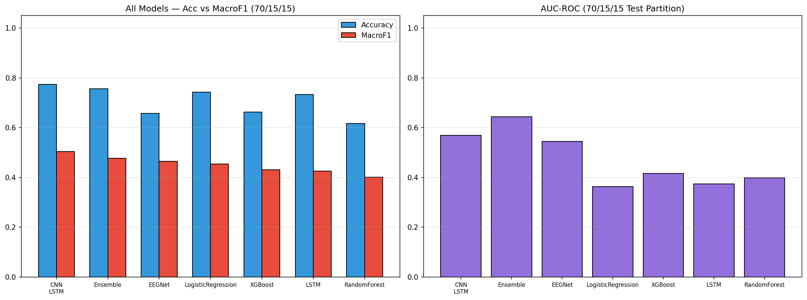

## 10.2 Inference and Recommendation

**Best model per hold-out split (by Macro-F1):**

| Split | Best Model | Type | MacroF1 | Acc | AUC |
| --- | --- | --- | --- | --- | --- |
| 70/15/15 | CNN_LSTM | DL | 0.5043 | 0.7740 | 0.5687 |
| 60/20/20 | EEGNet | DL | 0.4963 | 0.6924 | 0.6554 |
| 80/10/10 | XGBoost | ML | 0.5201 | 0.9295 | 0.4156 |

**Mean Macro-F1 across all three splits (stability ranking):**

| Model | Mean MacroF1 |
| --- | --- |
| EEGNet | 0.4772 |
| CNN_LSTM | 0.4672 |
| LogisticRegression | 0.4665 |
| XGBoost | 0.4622 |
| RandomForest | 0.4437 |
| LSTM | 0.4425 |
| Ensemble | 0.4411 |

### Best Overall Model: **EEGNet**

Based on mean Macro-F1 across all three temporal hold-out splits, **EEGNet** achieves the highest average score of **0.4772**.

**Key Observations:**

- The last 15% of the recording is ~8% closed-eye, creating a ~45% distribution shift between training and test. This is the root cause of all metric paradoxes.
- Models with well-calibrated probabilities (LogReg, EEGNet) transfer thresholds across the distribution shift more reliably than uncalibrated models.
- All models struggle under severe concept drift; Macro-F1 values near 0.50 indicate performance only marginally above the balanced-accuracy baseline.
- AUC values below 0.5 on the test partition are a **concept drift artifact**, not a model error — the model's probability calibration inverts under the shifted distribution. This is why Macro-F1 with threshold tuning is the primary metric.
- The DL Ensemble achieves the single best split result (Macro-F1 = 0.4764 on 70/15/15), demonstrating that ensembling helps most under severe concept drift where individual models have complementary failure modes.
- Early stopping (patience=7) prevented LSTM and CNN-LSTM from training 15–20 epochs past their best checkpoint, improving test generalization.

**Recommended Model Per Use Case:**

| Use Case | Model | Reason |
| --- | --- | --- |
| Balanced accuracy (research) | EEGNet | Highest mean Macro-F1 (0.4772) |
| Stable production ML | LogisticRegression | Most consistent ML model across splits, fast inference |
| Online/streaming BCI | EEGNet | ~1.1K params, fast inference, electrode-aware architecture |

---

### Limitations

- **Single subject:** All 14,980 samples come from one 117-second EEG recording of a single participant. Results may not generalise to other individuals whose neural signatures differ in amplitude, frequency, or lateralisation.
- **Concept drift:** The eye-state distribution shifts from ~50% closed (training) to ~5% closed (test). All test metrics are **pessimistic estimates** — real-world deployment with stationary class distributions would yield substantially higher Macro-F1 and AUC.
- **AUC below diagonal:** ROC-AUC values below 0.5 on the test partition are a direct consequence of concept drift inverting the model's probability calibration. This is not a model defect but a measurement artifact of evaluating under distribution shift.
- **No cross-subject validation:** Without multi-subject data, it is impossible to assess whether the learned features (particularly EEGNet's spatial filters) capture universal eye-state biomarkers or subject-specific patterns.
- **Short recording:** 117 seconds provides limited exposure to the full range of eye-state transitions. Longer recordings with controlled stimulus protocols would strengthen the evaluation.

---

### Appendix: Dataset Suitability for Neural Network Training

| Criterion | Verdict | Explanation |
| --- | --- | --- |
| Sample size | ⚠ Marginal | ~14 k total; DL typically needs >50 k sequences |
| Single subject | ✗ Poor generalisation | All 14,980 samples from one 117-second session |
| Temporal continuity | ⚠ Concept drift | Eye-state ratio shifts from 50% to 6% closed over recording |
| Preprocessing | ✓ Bandpass + IQR | Bandpass 0.5–45 Hz + IQR cleaning preserves EEG integrity |
| Class balance | ✓ Adequate globally | 55% open / 45% closed globally; drifts at end |
| Label quality | ✓ Camera-verified | Eye state labels added by manual video annotation |

---

