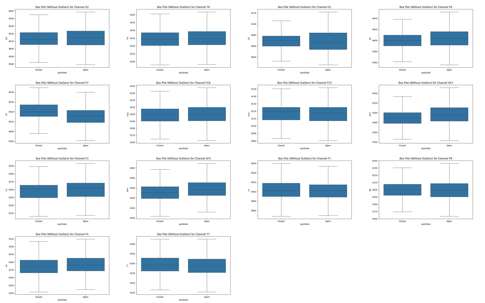
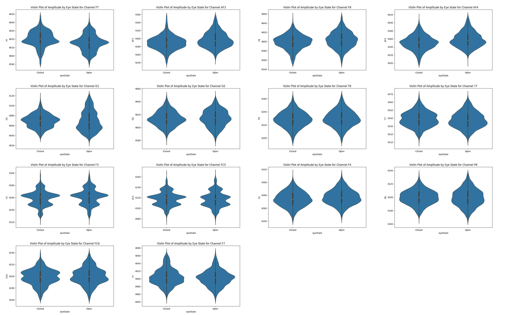

# Classiying eye state using the EEG features:

Dataset Analysis / Loading and Parsing
Dataset Inspection -> Separate Feature / Target Value
Data Validation
Missing Data fill by N/A
Data Cleaning (remove outlier / scaling)
Data (Uni/Bivariate) Visualization (spike value b/a analysis via spectrogram) 
PCA / LDA performn (Identify redundant Feature Column w/ correlation >.8)

## Exploratory Data Analysis (EDA):

* Dataset description:
	
	- Dataset link: https://archive.ics.uci.edu/dataset/264/eeg+eye+state
	- Collection: The EEG data was collected using the 'Emotiv EPOC headset'
	- File Type: `.arff`
	- Unit: microvolts (µV) [Feature Columns] / boolean {0,1} [Target Variable]
	- Sampling Rate: 128 Hz (i.e. 128 row of data / second)
	- Dataset Dimension: 14980 rows (data) x 15 column (feature)
		
	The numeric values in the EEG Eye State dataset represent microvolts, which are the amplitude of the raw EEG signal measurements. 
	
	Measurement: They are time-domain, continuous EEG measurements taken from 14 electrodes on an Emotiv EEG Neuroheadset.

	Sampling Rate: The data was recorded at a sampling frequency of 128 Hz (128 samples per second).
	
	Duration: The total measurement duration was 117 seconds, resulting in 14,980 samples for each electrode channel.

* Dataset Loading and Parsing:
	
	- Parse the Dataset: Convert the `.arff` file into `.csv` for ease of processing
	- Load the Dataset: Read the data into a suitable data structure (e.g., a Pandas DataFrame in Python)

* Data Inspection:

	- Examine dataset and separate feature and target variable column:

		1. Feature Columns:

		

		| Column (Electrode) | Description (Brain Region for Electrode / Probe Location) | Type  | Units |
		|-----------------|-------------------------------------------------|-------|-------|
		| AF3 | Frontal (Anterior Frontal) - Left front of the forehead, near the prefrontal cortex | Float | microvolts (µV) |
		| F7  | Frontal (Lateral Frontal) - Left frontal lobe, near the temple                      | Float | microvolts (µV) |
		| F3  | Frontal (Frontal Midline) - Left frontal lobe, above the eyebrow                    | Float | microvolts (µV) |
		| FC5 | Fronto-Central - Left fronto-central area, between frontal and central lobes	 	| Float | microvolts (µV) |
		| T7  | Temporal - Left temporal lobe, above the ear                         			 	| Float | microvolts (µV) |
		| P7  | Parietal - Left parietal lobe, posterior to T7                       			 	| Float | microvolts (µV) |
		| O1  | Occipital - Left occipital lobe, visual processing area               			   	| Float | microvolts (µV) |
		| O2  | Occipital - Right occipital lobe, visual processing area              			   	| Float | microvolts (µV) |
		| P8  | Parietal - Right parietal lobe, posterior to T8                      				| Float | microvolts (µV) |
		| T8  | Temporal - Right temporal lobe, above the ear                        				| Float | microvolts (µV) |
		| FC6 | Fronto-Central - Right fronto-central area                                 		   	| Float | microvolts (µV) |
		| F4  | Frontal - Right frontal lobe, above the eyebrow                     				| Float | microvolts (µV) |
		| F8  | Frontal (Lateral Frontal)  Right frontal lobe, near the temple                      | Float | microvolts (µV) |
		| AF4 | Frontal (Anterior Frontal) Right prefrontal cortex, front of the forehead           | Float | microvolts (µV) |
		
		

		
		 
		
		

			
		

		

		<i>Figure: Electrode probe locations and approximate brain regions for the 14-channel Emotiv headset (highlighted by red circles) used in the EEG Eye State dataset</i>
		

		2. Target Column:

		

		| Column	   | Description 												    | Type 	  | Unit		|
		|--------------|-------------------------------|---------|-------------|
		| eyeDetection | Resembles state of eye, either opened ('1') or closed ('0')	| Boolean | N/A			|
		
		

	- Validate data types of all columns:

		1. numerical data validation for EEG channels (feature columns data)
		2. boolean data validation for eyeDetection (target column data)

	- Check for Missing Values: 
	
		Identify any null or missing data points and fill by `n/a`

	- Summary Descriptive Statistics for each numeric column to understand data distribution and range: 
	
		

		
		| column | mean | median | mode | min | max | std dev | 1st quartile | median | 3rd quartile |
		|---|---:|---:|---:|---:|---:|---:|---:|---:|---:|
		| AF3 | 4321.92 | 4294.36 | 4291.79 | 1030.77 | 309231.00 | 2492.07 | 4280.51 | 4294.36 | 4311.79 |
		| F7 | 4009.77 | 4005.64 | 4003.59 | 2830.77 | 7804.62 | 45.94 | 3990.77 | 4005.64 | 4023.08 |
		| F3 | 4264.02 | 4262.56 | 4263.59 | 1040.00 | 6880.51 | 44.43 | 4250.26 | 4262.56 | 4270.77 |
		| FC5 | 4164.95 | 4120.51 | 4122.56 | 2453.33 | 642564.00 | 5216.40 | 4108.21 | 4120.51 | 4132.31 |
		| T7 | 4341.74 | 4338.97 | 4332.31 | 2089.74 | 6474.36 | 34.74 | 4331.79 | 4338.97 | 4347.18 |
		| P7 | 4644.02 | 4617.95 | 4616.41 | 2768.21 | 362564.00 | 2924.79 | 4611.79 | 4617.95 | 4626.67 |
		| O1 | 4110.40 | 4070.26 | 4072.31 | 2086.15 | 567179.00 | 4600.93 | 4057.95 | 4070.26 | 4083.59 |
		| O2 | 4616.06 | 4613.33 | 4610.77 | 4567.18 | 7264.10 | 29.29 | 4604.62 | 4613.33 | 4624.10 |
		| P8 | 4218.83 | 4199.49 | 4196.92 | 1357.95 | 265641.00 | 2136.41 | 4190.77 | 4199.49 | 4209.23 |
		| T8 | 4231.32 | 4229.23 | 4224.62 | 1816.41 | 6674.36 | 38.05 | 4220.51 | 4229.23 | 4239.49 |
		| FC6 | 4202.46 | 4200.51 | 4195.38 | 3273.33 | 6823.08 | 37.79 | 4190.26 | 4200.51 | 4211.28 |
		| F4 | 4279.23 | 4276.92 | 4273.85 | 2257.95 | 7002.56 | 41.54 | 4267.69 | 4276.92 | 4287.18 |
		| F8 | 4615.21 | 4603.08 | 4603.08 | 86.67 | 152308.00 | 1208.37 | 4590.77 | 4603.08 | 4617.44 |
		| AF4 | 4416.44 | 4354.87 | 4352.31 | 1366.15 | 715897.00 | 5891.29 | 4342.05 | 4354.87 | 4372.82 |

		

	
	- Target Variable Preparation: 
	
		Since we already have the target variable in boolean, we convert the eyeDetection column from numeric {0, 1} to a categorical data {closed state, open state}, which confirms it's a classification problem

* Data Overview:
	- Since the data is a temporal and based on signal, we make a spectrogram to get the overview of the raw data of signal (power / frequency) value over its full time scale (i.e. 117 second), which we get in a collage as given below:

	

		
	

	

		
	

	- What we realize is there's a similar spike in the values reading of the electrode at similar time between 0-20 second and 80 - ~100 second timeframe.
	- This part of investigation was cruicial to know due to uncertainity that if the it would get eliminated as an outlier, could mean critical loss of significant data and also since all these spike occured at approximately same duration meant the possibility of it be merely some random noise to be low from a generic perspective.
	- Hence, under domain specific knowledge base over data specification of instruments and neurophysiology, to know if such spike in value is normal from the instrument or from the brain waves (electrical signals) to be valid, it was found that such spike in values it to be part of external interference in the instruments or due to power fluctuation, thus we consider them as noise / outlier.

	

		
	

* Data Cleaning:

	Prepares the data for model training and makes the distributions comparable by:
	- removal of identified noise / outliers
	- feature scaling - while not strictly required for initial EDA, scaling the features (e.g., using StandardScaler or MinMaxScaler) 

* Data Visualization:

	1. Univariate Analysis: Plot histograms or density plots for each EEG channel to visualize the distribution of amplitude values. Visualize the class balance of the target variable using a bar chart or count plot (e.g., how many open vs. closed eye states).
		
		- Class Balance Diagram
		

			
		

		
		- Bar Chart / Histograms (with KDE curve / density plots / line graphs) for amplitude distribution
		

			
		

		- Box Plot 
		

			
		

		

			
		

		- Violin Plot Diagram (Before / After Outlier removal)
		

			
		

		
		- Scatter Plot Diagram
		

			
		

		- Power Spectral Density Chart
		

			
		

		
	2. Bivariate Analysis: Create correlation matrices (heatmaps) to understand the relationships between different electrode channels. Strong correlations can indicate redundant information or related brain activity areas. Use box plots or violin plots to visualize the distribution of each EEG channel's values across the two different eye states (open vs. closed). This helps determine which electrodes show the most significant difference between states.
		- Correlation Heat Map

	3. Dimensionality Reduction & Visualization (Optional):
	Use techniques like PCA (Principal Component Analysis) or t-SNE to reduce the dimensionality and visualize the data in 2D or 3D space, potentially using different colors for the two eye states to see if they are linearly separable.
	
	4. Time-Series Analysis (Optional): Since the data is sequential, you could plot time-series segments for a better understanding of how the signal fluctuates over time during open vs. closed states.

## Summarization:

* Document Insights:

	Summarize key findings from the EDA phase:
	- Since we already have the target column and dataset, so it's evident that to be a classification problem
	- Now we note, which channels (feature column) seem to be most important or correlated, 
	- class imbalance issues, or interesting correlations, which will guide subsequent model selection and feature engineering efforts.

	The final attribute, eyeDetection, is a binary classification target where: 
	- 1 means the eye is open
	- 0 means the eye is closed

* What the Data Represents:

	- Features: 14 continuous EEG signals (channels) over time.
	- Target: Eye state (`0`=open, `1`=closed).
	- Data: Sequential, time-series, single-subject, multivariate.
	- Use case: Predict whether the subject’s eyes are open or closed, which has applications in medical research, brain-computer interfaces, and human-computer interaction.

## Machine Learning Algorithms

* Several algorithms have been successfully tested on this dataset. Each has its strengths depending on the level of model complexity, interpretability, and data characteristics:

	- Random Forest: Offers high accuracy, feature importance, and handles non-linear relationships well.
	- Support Vector Machine (SVM): Works well for binary classification and high-dimensional spaces.
	- Gradient Boosting (e.g., XGBoost): Often delivers top results for tabular data classification tasks.
	- Multi-Layer Perceptron (MLP): Neural network model that offers good performance—especially with larger, complex data.
	- K-Nearest Neighbors (kNN): Simple, easy-to-interpret, and often surprisingly effective for this type of data.
	- Convolutional Neural Networks (CNN): If you treat the EEG data as local spatial patterns, CNNs can also be used and achieve strong results.
	- Hybrid/Ensemble Models: Some studies use models like bagged trees or combine neural nets with SOMs for further accuracy boosts.

* There are various ways to measure the performance metrics in the context of machine learning algorithms; common metric types and representative measures are:

	| Metric Type | Example Metrics | Description | Best used for |
	|-------------|-----------------|-------------|---------------|
	| Classification (threshold-dependent) | Accuracy, Precision, Recall, F1-score | Measures class prediction quality after applying a decision threshold | Balanced or thresholded binary/multiclass tasks |
	| Probabilistic / Loss | Log Loss (Cross-Entropy), Binary Cross-Entropy | Penalizes poorly calibrated probability estimates | When model outputs probabilities and calibration matters |
	| Ranking / Threshold-independent | ROC-AUC, PR-AUC (Average Precision) | Evaluates ranking quality of predicted scores across thresholds | Imbalanced classes or ranking tasks (PR-AUC for rare positives) |
	| Confusion-based | Confusion Matrix, Specificity, False Positive Rate | Breaks down types of prediction errors (TP/FP/TN/FN) | Detailed error analysis and threshold tuning |
	| Calibration | Brier Score, Calibration Curve / ECE | Assesses how well predicted probabilities reflect true outcome frequencies | Probability-sensitive decisions (risk scoring, forecasting) |
	| Agreement / Robustness | Matthews Correlation Coefficient (MCC), Cohen’s Kappa | Single-value measures robust to class imbalance and agreement beyond chance | Imbalanced datasets or comparing classifiers |
	| Computational / Operational | Inference Latency, Throughput (req/s), Model Size, FLOPs | Measures runtime cost and deployability of models | Production constraints, edge deployment |
	| Time-series / Temporal | Time-dependent accuracy, Autocorrelation-based metrics, Segment-wise F1 | Evaluates sequence consistency and temporal prediction quality | Sequential or streaming data (EEG/time-series) |

	Use a small set of complementary metrics (e.g., ROC-AUC + F1 + confusion matrix + latency) tailored to the task, class balance, and deployment constraints.

## Conclusion:

The data is used for predictive classification of eye states using multichannel EEG readings. Standard ML algorithms like Random Forest, SVM, Gradient Boosting, MLP, and CNN are all suitable and proven performers for this benchmark. Ensemble and deep learning approaches may deliver the highest accuracy, but tree-based models remain a robust, interpretable baseline

- Random Forest and XGBoost models routinely achieve accuracy scores above 88-90% for eye state classification on this dataset, with deep learning models (MLP, CNN) often matching or exceeding these results if tuned and given enough data.
- Feature selection (e.g., PCA, correlation analysis) further improves performance and model simplicity.

# TODOs:
	- EDA Visualization of collage of dataset
	- Change eyeDetection from boolean to Categorical data
	- Find the ideal threshold for correlation *
	- Perform PCA / LDA on the set and analyse the result and plot in graph
	- Time series analysis (autocorrelation or some better approach?)
	- Proper Modelling Machine Learning Algorithm + Use Cross Entropy / BCE / Softmax / Gradient Descent
	- Performance Metrics (F1/ Recall / Confusion Matrix)
	- Prepare report slide