# EEG Eye State Classification and Analysis Report using Machine and Deep Learning Algorithm

---

**Dataset Source:** [UCI Machine Learning Repository — EEG Eye State](https://archive.ics.uci.edu/dataset/264/eeg+eye+state)

**Submitted to:** 
- Prof. Giuseppe Longo, 
- Prof.ssa Roberta Siciliano (University of Naples Federico II)

**Report by:** 
- Andrea Manzo
- Francesco Ventimiglia
- Danilo Rodriguez
- Rohan Baidya

---

## Table of Contents

- [EEG Eye State Classification and Analysis Report using Machine and Deep Learning Algorithm](#eeg-eye-state-classification-and-analysis-report-using-machine-and-deep-learning-algorithm)
  - [Table of Contents](#table-of-contents)
  - [Process Work Flow](#process-work-flow)
- [1. Data Description Overview](#1-data-description-overview)
  - [1.1 Dataset Citation \& Source](#11-dataset-citation--source)
  - [1.2 Dataset Loading](#12-dataset-loading)
  - [1.3 Variable Classification \& Electrode Positions](#13-variable-classification--electrode-positions)
  - [1.4 Basic Statistics](#14-basic-statistics)
  - [1.5 Class Distribution](#15-class-distribution)
- [2. Data Imputation](#2-data-imputation)
- [3. Data Visualization (Raw Data)](#3-data-visualization-raw-data)
  - [3.1 Class Balance](#31-class-balance)
  - [3.2 Correlation Heatmap](#32-correlation-heatmap)
  - [3.3 Box Plots](#33-box-plots)
  - [3.4 Histograms](#34-histograms)
  - [3.5 Violin Plots](#35-violin-plots)
- [4. Signal Preprocessing](#4-signal-preprocessing)
  - [4.1 IQR Spike Removal (applied first, before filtering)](#41-iqr-spike-removal-applied-first-before-filtering)
  - [4.2 Bandpass Filter (0.5–45 Hz) — applied after spike removal](#42-bandpass-filter-0545-hz--applied-after-spike-removal)
- [5. Data Visualization (After Preprocessing)](#5-data-visualization-after-preprocessing)
  - [5.1 Corrected Correlation Heatmap (after preprocessing)](#51-corrected-correlation-heatmap-after-preprocessing)
  - [5.2 Box Plots Comparison](#52-box-plots-comparison)
  - [5.3 Histograms After Cleaning](#53-histograms-after-cleaning)
- [6. Log-Normalization Assessment (Rejected)](#6-log-normalization-assessment-rejected)
  - [6.1 Before vs After — All Channels](#61-before-vs-after--all-channels)
  - [6.2 Skewness \& Kurtosis Analysis](#62-skewness--kurtosis-analysis)
  - [6.3 Summary Statistics Before vs After](#63-summary-statistics-before-vs-after)
- [7. Feature Engineering](#7-feature-engineering)
  - [7.1 Hemispheric Asymmetry](#71-hemispheric-asymmetry)
  - [7.2 Frequency Band Power Features](#72-frequency-band-power-features)
- [8. FFT, Spectrogram and PSD Analysis](#8-fft-spectrogram-and-psd-analysis)
  - [8.1 FFT Frequency Spectrum](#81-fft-frequency-spectrum)
  - [8.2 Power Spectral Density (PSD)](#82-power-spectral-density-psd)
  - [8.3 Spectrogram Analysis](#83-spectrogram-analysis)
- [9. Dimensionality Reduction](#9-dimensionality-reduction)
  - [9.1 LDA](#91-lda)
  - [9.2 t-SNE](#92-t-sne)
  - [9.3 UMAP](#93-umap)
  - [9.4 Clustering Evaluation](#94-clustering-evaluation)
  - [9.5 Inference: Dimensionality Reduction Comparison](#95-inference-dimensionality-reduction-comparison)
- [10. Machine Learning Classification](#10-machine-learning-classification)
  - [10.1 Temporal Concept Drift Diagnosis](#101-temporal-concept-drift-diagnosis)
  - [10.2 Split Configurations](#102-split-configurations)
  - [10.3 Cross-Validation Results (5-Fold TimeSeriesSplit)](#103-cross-validation-results-5-fold-timeseriessplit)
  - [10.4 Hold-Out Split Results](#104-hold-out-split-results)
    - [Split 70/15/15](#split-701515)
    - [Split 60/20/20](#split-602020)
    - [Split 80/10/10](#split-801010)
  - [10.5 Walk-Forward CV (Expanding Window) — 5 Folds](#105-walk-forward-cv-expanding-window--5-folds)
  - [10.6 Sliding-Window CV (Fixed-Size Window) — 5 Folds](#106-sliding-window-cv-fixed-size-window--5-folds)
- [11. Deep Learning Classification](#11-deep-learning-classification)
  - [11.0 Architecture Overview \& Training Setup](#110-architecture-overview--training-setup)
    - [Split 70/15/15](#split-701515-1)
  - [11.1 LSTM](#111-lstm)
  - [11.2 CNN\_LSTM](#112-cnn_lstm)
  - [11.3 EEGTransformer](#113-eegtransformer)
  - [11.4 EEGNet](#114-eegnet)
  - [11.5 PatchTST\_Lite](#115-patchtst_lite)
  - [11.6 Soft-Vote Ensemble — 70/15/15](#116-soft-vote-ensemble--701515)
  - [11.7 DL Model Comparison — 70/15/15](#117-dl-model-comparison--701515)
    - [Split 60/20/20](#split-602020-1)
  - [11.6 Soft-Vote Ensemble — 60/20/20](#116-soft-vote-ensemble--602020)
  - [11.7 DL Model Comparison — 60/20/20](#117-dl-model-comparison--602020)
    - [Split 80/10/10](#split-801010-1)
  - [11.6 Soft-Vote Ensemble — 80/10/10](#116-soft-vote-ensemble--801010)
  - [11.7 DL Model Comparison — 80/10/10](#117-dl-model-comparison--801010)
- [12. Final Comparison and Inference](#12-final-comparison-and-inference)
  - [12.1 Unified Model Comparison](#121-unified-model-comparison)
    - [Split 70/15/15](#split-701515-2)
    - [Split 60/20/20](#split-602020-2)
    - [Split 80/10/10](#split-801010-2)
  - [12.2 Inference and Recommendation](#122-inference-and-recommendation)
    - [Best Overall Model: **EEGNet**](#best-overall-model-eegnet)

---

## Process Work Flow

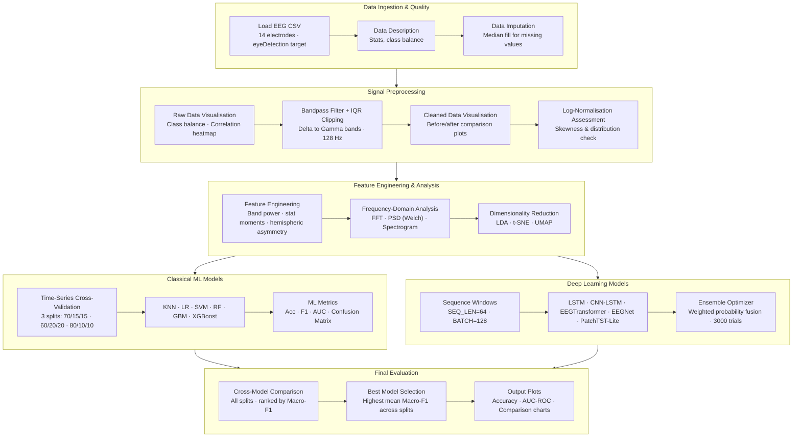
```mermaid
flowchart TD
    %% ── DATA INGESTION & QUALITY ──────────────────────────
    subgraph A["Data Ingestion & Quality"]
        A1["Load EEG CSV\n14 electrodes · eyeDetection target"]
        A2["Data Description\nStats, class balance"]
        A3["Data Imputation\nMedian fill for missing values"]
        A1 --> A2 --> A3
    end

    %% ── SIGNAL PREPROCESSING ─────────────────────────────
    subgraph B["Signal Preprocessing"]
        B1["Raw Data Visualisation\nClass balance · Correlation heatmap"]
        B2["Bandpass Filter + IQR Clipping\nDelta to Gamma bands · 128 Hz"]
        B3["Cleaned Data Visualisation\nBefore/after comparison plots"]
        B4["Log-Normalisation Assessment\nSkewness & distribution check"]
        B1 --> B2 --> B3 --> B4
    end

    %% ── FEATURE ENGINEERING & ANALYSIS ──────────────────
    subgraph C["Feature Engineering & Analysis"]
        C1["Feature Engineering\nBand power · stat moments · hemispheric asymmetry"]
        C2["Frequency-Domain Analysis\nFFT · PSD (Welch) · Spectrogram"]
        C3["Dimensionality Reduction\nLDA · t-SNE · UMAP"]
        C1 --> C2 --> C3
    end

    %% ── ML MODELS ────────────────────────────────────────
    subgraph D["Classical ML Models"]
        D1["Time-Series Cross-Validation\n3 splits: 70/15/15 · 60/20/20 · 80/10/10"]
        D2["KNN · LR · SVM · RF · GBM · XGBoost"]
        D3["ML Metrics\nAcc · F1 · AUC · Confusion Matrix"]
        D1 --> D2 --> D3
    end

    %% ── DL MODELS ────────────────────────────────────────
    subgraph E["Deep Learning Models"]
        E1["Sequence Windows\nSEQ_LEN=64 · BATCH=128"]
        E2["LSTM · CNN-LSTM · EEGTransformer · EEGNet · PatchTST-Lite"]
        E3["Ensemble Optimizer\nWeighted probability fusion · 3000 trials"]
        E1 --> E2 --> E3
    end

    %% ── EVALUATION ───────────────────────────────────────
    subgraph F["Final Evaluation"]
        F1["Cross-Model Comparison\nAll splits · ranked by Macro-F1"]
        F2["Best Model Selection\nHighest mean Macro-F1 across splits"]
        F3["Output Plots\nAccuracy · AUC-ROC · Comparison charts"]
        F1 --> F2 --> F3
    end

    %% ── GLOBAL FLOW ──────────────────────────────────────
    A --> B --> C
    C --> D
    C --> E
    D --> F
    E --> F
```

# 1. Data Description Overview

## 1.1 Dataset Citation & Source

**Source:** [UCI Machine Learning Repository — EEG Eye State](https://archive.ics.uci.edu/dataset/264/eeg+eye+state)

> All data is from one continuous EEG measurement with the Emotiv EEG Neuroheadset. The duration of the measurement was 117 seconds. The eye state was detected via a camera during the EEG measurement and added later manually to the file after analysing the video frames. '1' indicates the eye-closed and '0' the eye-open state. All values are in chronological order with the first measured value at the top of the data.

## 1.2 Dataset Loading

The dataset is loaded from `dataset/eeg_data_og.csv`.

| Property | Value |
| --- | --- |
| Samples | 14980 |
| Features | 14 |
| Target Column | eyeDetection |
| Sampling Rate | 128 Hz |
| Recording Duration | 117.0 seconds |

## 1.3 Variable Classification & Electrode Positions

**Numerical Variables (Continuous):** 14 EEG electrode channels recording voltage in micro-volts (µV). The Emotiv EPOC headset uses a modified 10-20 international system for electrode placement. Each electrode captures electrical activity from a specific cortical region.

| Electrode | Type | 10-20 Position | Brain Region | Functional Significance |
| --- | --- | --- | --- | --- |
| AF3 | Continuous (float64) | Anterior Frontal Left | Prefrontal Cortex | Executive function, attention |
| F7 | Continuous (float64) | Frontal Left Lateral | Left Temporal-Frontal | Language processing |
| F3 | Continuous (float64) | Frontal Left | Left Frontal Lobe | Motor planning, positive affect |
| FC5 | Continuous (float64) | Fronto-Central Left | Left Motor-Frontal | Motor preparation |
| T7 | Continuous (float64) | Temporal Left | Left Temporal Lobe | Auditory processing, memory |
| P7 | Continuous (float64) | Parietal Left | Left Parietal-Temporal | Visual-spatial processing |
| O1 | Continuous (float64) | Occipital Left | Left Visual Cortex | Visual processing |
| O2 | Continuous (float64) | Occipital Right | Right Visual Cortex | Visual processing |
| P8 | Continuous (float64) | Parietal Right | Right Parietal-Temporal | Spatial attention |
| T8 | Continuous (float64) | Temporal Right | Right Temporal Lobe | Face / emotion recognition |
| FC6 | Continuous (float64) | Fronto-Central Right | Right Motor-Frontal | Motor preparation |
| F4 | Continuous (float64) | Frontal Right | Right Frontal Lobe | Motor planning, negative affect |
| F8 | Continuous (float64) | Frontal Right Lateral | Right Temporal-Frontal | Emotion, social cognition |
| AF4 | Continuous (float64) | Anterior Frontal Right | Prefrontal Cortex | Executive function, attention |

**Categorical Variable (Target):**

| Variable | Type | Values | Description |
| --- | --- | --- | --- |
| eyeDetection | Binary (int) | 0 = Open, 1 = Closed | Eye state detected via camera during recording |

## 1.4 Basic Statistics

Descriptive statistics for all 14 EEG channels (µV).

| Channel | Count | Mean | Std | Min | 25% | 50% | 75% | Max | Mode |
| --- | --- | --- | --- | --- | --- | --- | --- | --- | --- |
| AF3 | 14980 | 4321.92 | 2492.07 | 1030.77 | 4280.51 | 4294.36 | 4311.79 | 309231.00 | 4291.79 |
| F7 | 14980 | 4009.77 | 45.94 | 2830.77 | 3990.77 | 4005.64 | 4023.08 | 7804.62 | 4003.59 |
| F3 | 14980 | 4264.02 | 44.43 | 1040.00 | 4250.26 | 4262.56 | 4270.77 | 6880.51 | 4263.59 |
| FC5 | 14980 | 4164.95 | 5216.40 | 2453.33 | 4108.21 | 4120.51 | 4132.31 | 642564.00 | 4122.56 |
| T7 | 14980 | 4341.74 | 34.74 | 2089.74 | 4331.79 | 4338.97 | 4347.18 | 6474.36 | 4332.31 |
| P7 | 14980 | 4644.02 | 2924.79 | 2768.21 | 4611.79 | 4617.95 | 4626.67 | 362564.00 | 4616.41 |
| O1 | 14980 | 4110.40 | 4600.93 | 2086.15 | 4057.95 | 4070.26 | 4083.59 | 567179.00 | 4072.31 |
| O2 | 14980 | 4616.06 | 29.29 | 4567.18 | 4604.62 | 4613.33 | 4624.10 | 7264.10 | 4610.77 |
| P8 | 14980 | 4218.83 | 2136.41 | 1357.95 | 4190.77 | 4199.49 | 4209.23 | 265641.00 | 4196.92 |
| T8 | 14980 | 4231.32 | 38.05 | 1816.41 | 4220.51 | 4229.23 | 4239.49 | 6674.36 | 4224.62 |
| FC6 | 14980 | 4202.46 | 37.79 | 3273.33 | 4190.26 | 4200.51 | 4211.28 | 6823.08 | 4195.38 |
| F4 | 14980 | 4279.23 | 41.54 | 2257.95 | 4267.69 | 4276.92 | 4287.18 | 7002.56 | 4273.85 |
| F8 | 14980 | 4615.21 | 1208.37 | 86.67 | 4590.77 | 4603.08 | 4617.44 | 152308.00 | 4603.08 |
| AF4 | 14980 | 4416.44 | 5891.29 | 1366.15 | 4342.05 | 4354.87 | 4372.82 | 715897.00 | 4352.31 |

> **Note on Spike Artifacts:** Some channels exhibit extremely large max values — orders of magnitude above the 75th percentile. These are likely **electrode spike artifacts** caused by momentary loss of contact, muscle movement, or impedance changes in the Emotiv headset. These extreme values will be addressed by the outlier removal step.

## 1.5 Class Distribution

Distribution of the target variable `eyeDetection` (per UCI: 0 = open, 1 = closed).

| Eye State | Count | Percentage |
| --- | --- | --- |
| Open (0) | 8257 | 55.1% |
| Closed (1) | 6723 | 44.9% |

# 2. Data Imputation

Missing values are detected and filled using column-wise **median imputation** to preserve the statistical properties of each EEG channel.

**Result:** No missing values detected across any of the 14 EEG channels. The dataset is complete.

# 3. Data Visualization (Raw Data)

Visualizations of the raw EEG data before any preprocessing.

## 3.1 Class Balance

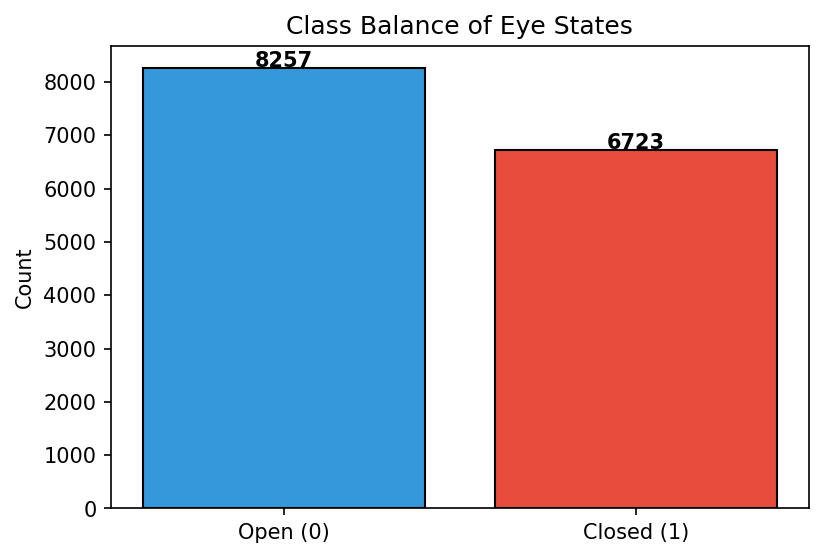

## 3.2 Correlation Heatmap

The correlation heatmap reveals linear relationships between EEG channels. Highly correlated channels may carry redundant information.

> **Note on spike artifacts:** The raw dataset contains extreme hardware spike artifacts (e.g., AF3 max ≈ 309,231 µV, FC5 max ≈ 642,564 µV) with values **75–150× the 99th percentile**. When multiple distant channels spike simultaneously (e.g., AF3 and P8 co-spike on ~82 samples), those extreme outliers dominate the Pearson calculation and produce **artificial r ≈ 1.00** between electrodes that should be uncorrelated. The heatmap below is therefore computed on data **winsorized at the 1st–99th percentile** to expose the true inter-channel structure. The full preprocessing pipeline (IQR spike removal → bandpass filter) in Section 4 corrects this permanently.

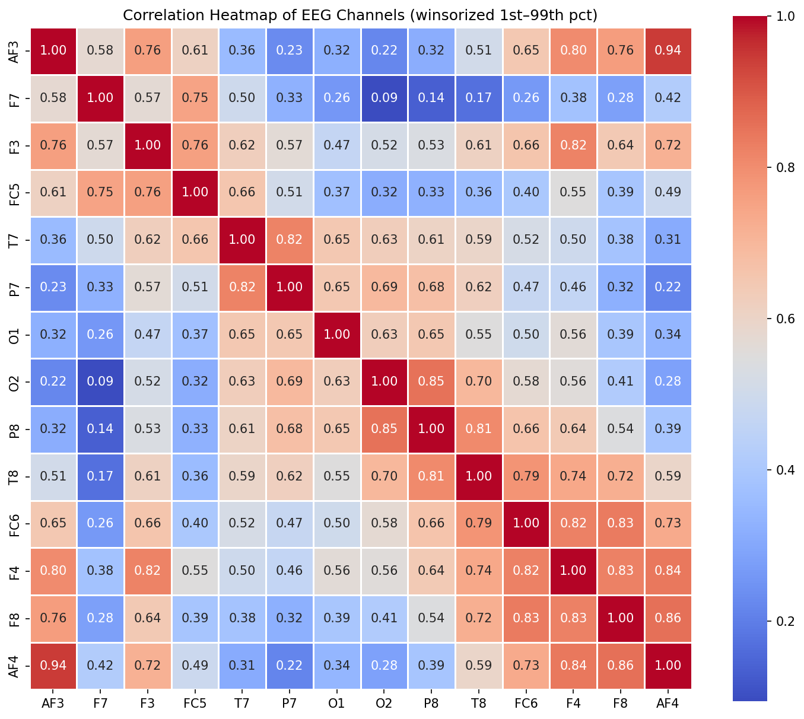

## 3.3 Box Plots

Box plots highlight potential outliers beyond the 1.5x IQR whiskers.

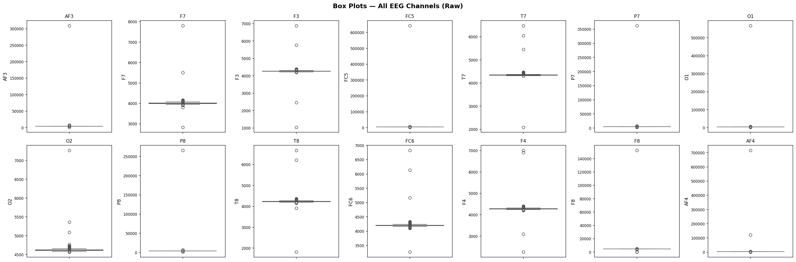

The raw box plots are compressed by extreme spike artifacts. Below is a **zoomed view** clipped at the 1st–99th percentile range to reveal the actual distribution of most samples.

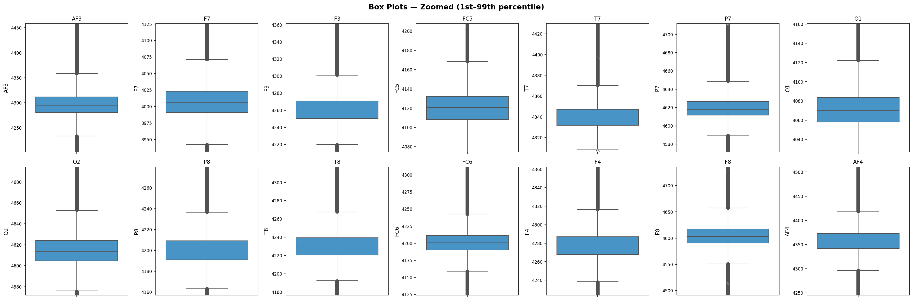

## 3.4 Histograms

Amplitude distributions per channel split by eye state.

## 3.5 Violin Plots

Violin plots combine box-plot summaries with kernel density estimates.

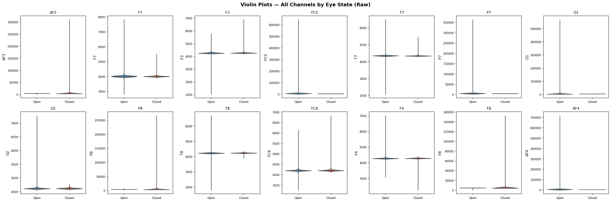

# 4. Signal Preprocessing

EEG signals contain artifacts from eye blinks, muscle movement, and electrode drift that must be removed before analysis. This section applies a two-stage cleaning pipeline in the **correct causal order**:

1. **IQR spike removal first** — raw hardware spike artifacts (up to 715,897 µV) are removed *before* filtering. Applying `filtfilt` to spikes first smears them to neighbouring samples via the backward pass, inflating data loss from ~9% to ~19%.

2. **Bandpass filter (0.5–45 Hz) second** — applied to the already spike-free signal so no artifact energy is convolved into the physiological EEG bands.

## 4.1 IQR Spike Removal (applied first, before filtering)

A **light IQR filter** (3.0x IQR, max 3 passes) removes hardware spike artifacts from the **raw** signal. Applying this step *before* filtering is critical: `filtfilt` convolves forward then backward, so a single spike at sample $t$ would contaminate samples $t - N$ through $t + N$ after filtering. Removing spikes first keeps those neighbouring samples clean and reduces total data loss from ~19% to ~9%.

Threshold: $Q_3 + 3.0 \times IQR$ (wider than the traditional 1.5× to preserve genuine EEG excursions while rejecting hardware glitches).

| Channel | Lower Bound (µV) | Upper Bound (µV) |
| --- | --- | --- |
| AF3 | 4186.67 | 4405.63 |
| F7 | 3897.95 | 4113.34 |
| F3 | 4193.35 | 4326.14 |
| FC5 | 4047.69 | 4187.69 |
| T7 | 4288.71 | 4389.23 |
| P7 | 4570.24 | 4667.19 |
| O1 | 3982.08 | 4157.92 |
| O2 | 4549.24 | 4678.46 |
| P8 | 4138.45 | 4260.53 |
| T8 | 4164.62 | 4293.84 |
| FC6 | 4127.70 | 4271.27 |
| F4 | 4213.33 | 4338.98 |
| F8 | 4517.41 | 4686.18 |
| AF4 | 4260.00 | 4450.26 |

| Metric | Value |
| --- | --- |
| Original samples | 14980 |
| After IQR removal | 13606 |
| Spike samples removed | 1374 |
| Removal % | 9.2% |
| IQR passes | 3 |
| IQR multiplier | 3.0x |

> Removing **1374 spike samples (9.2%)** from the raw signal before filtering. The wrong order (filter first, then IQR) would remove ~2,882 samples (19.2%) — more than double the data loss, because `filtfilt` spreads each spike to ~8–10 adjacent samples via its backward pass.

## 4.2 Bandpass Filter (0.5–45 Hz) — applied after spike removal

A **4th-order Butterworth bandpass filter** (0.5–45.0 Hz) removes DC drift and high-frequency noise while preserving the physiologically relevant EEG bands (Delta through Gamma). Applied via `scipy.signal.filtfilt` (zero-phase, forward-backward filtering) to avoid phase distortion.

$$H(s) = \frac{1}{\sqrt{1 + \left(\frac{s}{\omega_c}\right)^{2N}}}$$

Because spikes have already been removed, `filtfilt` operates on a clean signal and will not spread artifact energy to adjacent samples.

| Metric | Value |
| --- | --- |
| Original samples | 14980 |
| After IQR spike removal | 13606 |
| After bandpass filter | 13606 |
| Total removed | 1374 |
| Total removal % | 9.2% |
| Bandpass range | 0.5–45.0 Hz |
| Filter order | 4 |

> **Preprocessing Summary (corrected order):** IQR spike removal (3.0×, 9.2% removed) → Bandpass filter (0.5–45.0 Hz). Total retained: **13,606 / 14,980 samples (90.8%)**.

# 5. Data Visualization (After Preprocessing)

Comparison of distributions before and after preprocessing (IQR spike removal → bandpass filter).

## 5.1 Corrected Correlation Heatmap (after preprocessing)

With spike artifacts removed, the correlation heatmap now reflects the true physiological relationships between EEG channels. The artificial r ≈ 1.00 values seen in the raw data are eliminated. Some genuine frontal correlations (e.g., AF3–AF4 ≈ 0.94) remain and are expected given the Emotiv EPOC’s common reference architecture.

## 5.2 Box Plots Comparison

Side-by-side box plots confirm preprocessing effectiveness. Whiskers are set to **3.0x IQR** to match the cleaning threshold.

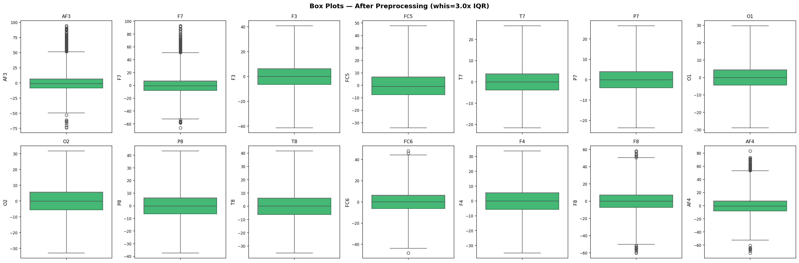

## 5.3 Histograms After Cleaning

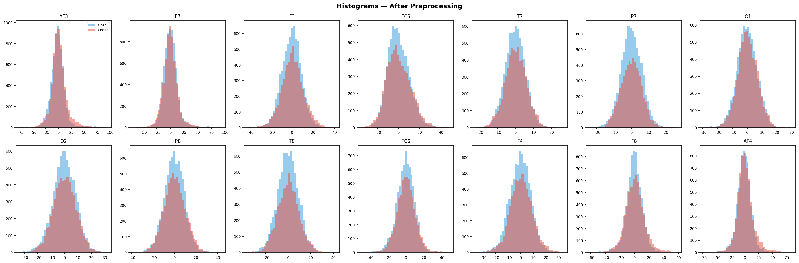

# 6. Log-Normalization Assessment (Rejected)

Logarithmic normalization compresses the dynamic range of EEG amplitudes, reducing the impact of extreme values and making distributions more symmetric. We test `log10(x - min + 1)` on each channel and evaluate whether it improves distribution quality. **The transformed data is not used downstream** — this section documents the assessment only.

## 6.1 Before vs After — All Channels

The following grid shows the distribution of every EEG channel before (blue) and after (red) log-normalization.

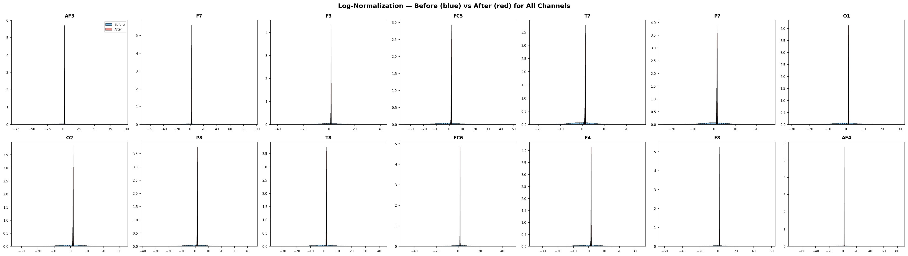

## 6.2 Skewness & Kurtosis Analysis

Skewness measures distribution asymmetry (0 = perfectly symmetric). Kurtosis (excess) measures tail heaviness (0 = normal). Log-normalization should reduce both towards zero.

| Channel | Skew Before | Skew After | Kurtosis Before | Kurtosis After | Improved? |
| --- | --- | --- | --- | --- | --- |
| AF3 | 1.1249 | -1.7574 | 4.9780 | 30.0971 | No |
| F7 | 0.8910 | -1.4597 | 4.3920 | 17.7217 | No |
| F3 | 0.0441 | -1.2756 | 0.3341 | 6.6803 | No |
| FC5 | 0.3711 | -1.0258 | 0.2470 | 4.1555 | No |
| T7 | 0.0352 | -1.1706 | 0.0545 | 4.4658 | No |
| P7 | 0.0262 | -1.2269 | 0.2009 | 5.4426 | No |
| O1 | -0.0039 | -1.4086 | 0.1945 | 8.5652 | No |
| O2 | -0.0519 | -1.5131 | 0.1288 | 7.3115 | No |
| P8 | 0.0219 | -1.2489 | 0.1634 | 5.2143 | No |
| T8 | 0.0111 | -1.5541 | 0.1634 | 8.0981 | No |
| FC6 | -0.0499 | -1.5858 | 0.8275 | 11.1655 | No |
| F4 | 0.0007 | -1.3406 | 0.2870 | 6.3222 | No |
| F8 | 0.0117 | -2.5708 | 1.7134 | 24.2710 | No |
| AF4 | 0.5082 | -2.0824 | 2.8507 | 25.3333 | No |

**Result:** Log-normalization improved distribution quality (reduced |skewness| + |kurtosis|) for **0/14 channels (0%)**.

> **Decision: Log-normalization REJECTED.** The transform worsened distribution quality for the majority of channels. After outlier removal, the EEG distributions are already approximately symmetric. **All subsequent analyses use the cleaned (non-transformed) data.**

## 6.3 Summary Statistics Before vs After

| Channel | Orig Mean | Orig Std | Norm Mean | Norm Std |
| --- | --- | --- | --- | --- |
| AF3 | -0.02 | 14.75 | 1.8665 | 0.0877 |
| F7 | -0.01 | 13.65 | 1.8170 | 0.0922 |
| F3 | -0.05 | 9.83 | 1.6127 | 0.1113 |
| FC5 | -0.02 | 10.62 | 1.5221 | 0.1442 |
| T7 | -0.02 | 5.71 | 1.3375 | 0.1220 |
| P7 | 0.00 | 5.88 | 1.3766 | 0.1149 |
| O1 | -0.01 | 6.68 | 1.4623 | 0.1075 |
| O2 | -0.05 | 8.44 | 1.5137 | 0.1233 |
| P8 | -0.05 | 9.53 | 1.5678 | 0.1205 |
| T8 | -0.03 | 9.35 | 1.5414 | 0.1280 |
| FC6 | -0.03 | 9.99 | 1.6812 | 0.0978 |
| F4 | -0.03 | 8.49 | 1.5426 | 0.1141 |
| F8 | -0.04 | 12.28 | 1.7763 | 0.1004 |
| AF4 | -0.03 | 14.03 | 1.8545 | 0.0903 |

# 7. Feature Engineering

Feature engineering derives new variables from raw EEG channels to capture domain-specific patterns for exploratory analysis. **Note:** The ML/DL pipeline in Sections 10–11 uses the raw 14 channels directly to avoid preprocessing data leakage.

## 7.1 Hemispheric Asymmetry

The asymmetry index $(Left - Right)$ for paired electrodes captures lateralisation differences linked to cognitive and emotional states.

| Feature | Left | Right | Mean | Std |
| --- | --- | --- | --- | --- |
| AF3_AF4_asym | AF3 | AF4 | 0.0144 | 7.5139 |
| F7_F8_asym | F7 | F8 | 0.0322 | 17.1728 |
| F3_F4_asym | F3 | F4 | -0.0172 | 6.5246 |
| FC5_FC6_asym | FC5 | FC6 | 0.0092 | 13.4120 |
| T7_T8_asym | T7 | T8 | 0.0095 | 8.9115 |
| P7_P8_asym | P7 | P8 | 0.0474 | 8.7216 |
| O1_O2_asym | O1 | O2 | 0.0351 | 7.0641 |

**Asymmetry by Eye State** — do hemispheric differences change with eye state?

| Feature | Mean (Open) | Mean (Closed) | t-statistic | p-value | Significant (p<0.05) |
| --- | --- | --- | --- | --- | --- |
| AF3_AF4_asym | -0.0857 | 0.1351 | -1.689 | 9.12e-02 | No |
| F7_F8_asym | 0.4338 | -0.4525 | 2.973 | 2.96e-03 | Yes |
| F3_F4_asym | -0.0980 | 0.0803 | -1.583 | 1.14e-01 | No |
| FC5_FC6_asym | 0.1758 | -0.1918 | 1.584 | 1.13e-01 | No |
| T7_T8_asym | 0.0153 | 0.0024 | 0.084 | 9.33e-01 | No |
| P7_P8_asym | 0.1988 | -0.1352 | 2.218 | 2.66e-02 | Yes |
| O1_O2_asym | -0.0133 | 0.0935 | -0.877 | 3.81e-01 | No |

**2/7** asymmetry features show a statistically significant difference between eye states (Welch's t-test, p < 0.05). Hemispheric asymmetry contributes partial discriminative signal.

## 7.2 Frequency Band Power Features

Band power features capture the relative energy in each EEG frequency band. Research shows that band powers — particularly alpha — are among the strongest predictors for eye state classification (up to 96% accuracy in papers).

$$P_{\text{band}}(t) = \frac{1}{C} \sum_{c=1}^{C} \left[x_c^{\text{band}}(t)\right]^2$$

| Feature | Band / Description | Mean | Std |
| --- | --- | --- | --- |
| band_Delta_power | 0.5–4 Hz | 59.4934 | 86.0268 |
| band_Theta_power | 4–8 Hz | 10.2390 | 11.3397 |
| band_Alpha_power | 8–12 Hz | 9.0096 | 11.1859 |
| band_Beta_power | 12–30 Hz | 14.3996 | 13.5507 |
| band_Gamma_power | 30–64 Hz | 3.3625 | 2.5647 |
| alpha_asymmetry | O1α² − O2α² | -4.5496 | 15.6202 |

**6 band power features** added. Alpha asymmetry captures the Berger effect.

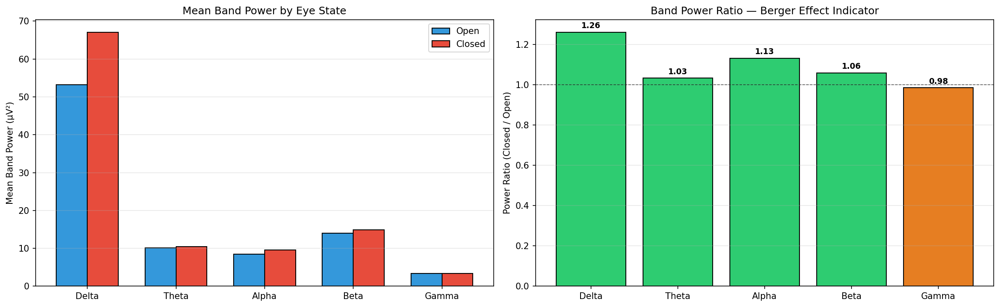

The bar chart above compares mean band power between eye-open and eye-closed states. A ratio > 1.0 indicates higher power during eye closure. The **alpha band** (8–12 Hz) is expected to show the strongest increase when eyes are closed (Berger effect), which is the primary physiological marker exploited by the classification models.

# 8. FFT, Spectrogram and PSD Analysis

Frequency-domain analysis reveals the power distribution across brain wave bands: **Delta** (0.5-4 Hz), **Theta** (4-8 Hz), **Alpha** (8-12 Hz), **Beta** (12-30 Hz), and **Gamma** (30-64 Hz). Alpha power increases when eyes are closed (the **Berger effect**).

## 8.1 FFT Frequency Spectrum

The FFT decomposes each EEG channel into constituent frequencies.

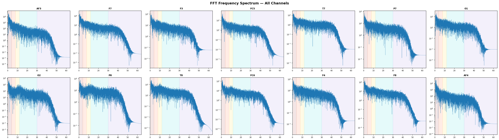

## 8.2 Power Spectral Density (PSD)

Welch's method estimates the PSD for each channel. Shaded regions indicate standard EEG frequency bands.

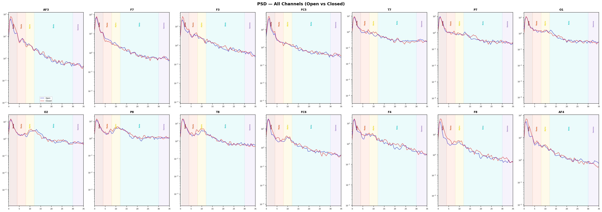

**PSD Interpretation — Berger Effect:** Alpha-band power (8–12 Hz) increases when the eyes are closed, particularly in occipital electrodes (O1, O2). If the red curve (closed) shows higher power in the alpha band compared to blue (open), this confirms the dataset captures genuine physiological differences between eye states.

## 8.3 Spectrogram Analysis

Spectrograms show the time-frequency power distribution. Horizontal dashed lines mark band boundaries.

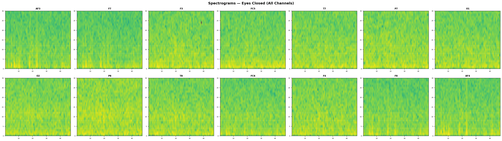

# 9. Dimensionality Reduction

Projecting high-dimensional EEG data into lower-dimensional spaces reveals clustering structure. **LDA** maximises class separability; **t-SNE** and **UMAP** capture non-linear manifold structure.

To improve class separation, we apply a feature-augmentation pipeline before projection: (1) IQR-based outlier removal on the feature space, (2) rolling-window statistics (mean and std, window=10), and (3) FFT magnitude features. This enriched representation captures both temporal dynamics and spectral content.

After IQR filtering on feature space: **8208** samples retained (removed 5398).

Augmented feature matrix: **116** dimensions (29 original + 29 rolling-mean + 29 rolling-std + 29 FFT).

## 9.1 LDA

LDA maximises the ratio of between-class to within-class variance, yielding a single discriminant for binary classification. Applied to the augmented feature space.

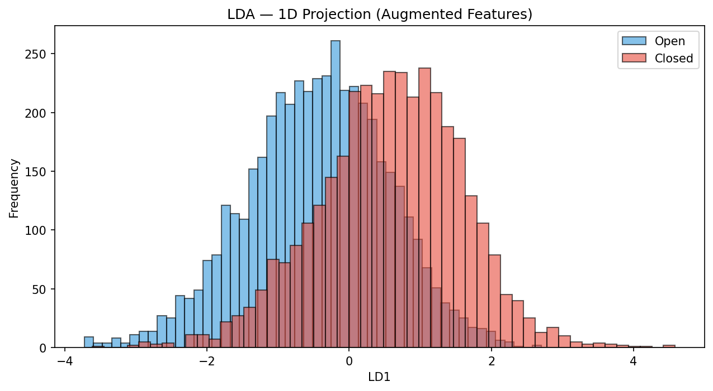

## 9.2 t-SNE

t-Distributed Stochastic Neighbor Embedding is a non-linear technique that preserves local neighbourhood structure. A subsample of 5000 points is used for computational efficiency.

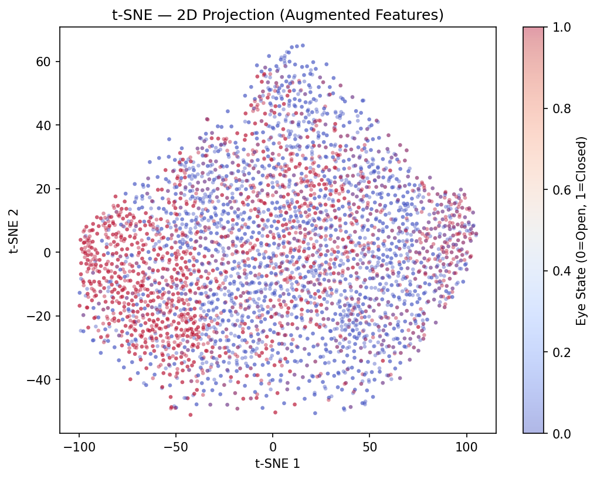

## 9.3 UMAP

UMAP preserves both local and global structure, often producing cleaner clusters than t-SNE.

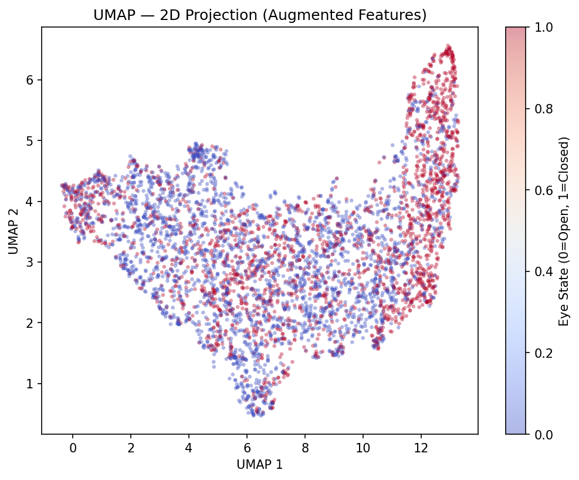

## 9.4 Clustering Evaluation

Clustering metrics quantify separation quality in reduced spaces.

| Method | Silhouette (higher better) | Davies-Bouldin (lower better) | Calinski-Harabasz (higher better) |
| --- | --- | --- | --- |
| LDA (1D) | 0.1556 | 1.5464 | 2137.80 |
| t-SNE (2D) | 0.0545 | 3.9085 | 269.92 |
| UMAP (2D) | 0.0652 | 3.6491 | 297.92 |

## 9.5 Inference: Dimensionality Reduction Comparison

| Method | Type | Strengths | Limitations | Best For |
| --- | --- | --- | --- | --- |
| **LDA** | Linear, supervised | Maximises class separation, single component for binary | Limited to C-1 components, assumes Gaussian classes | Binary/multi-class classification preprocessing |
| **t-SNE** | Non-linear, unsupervised | Excellent local structure preservation, reveals clusters | Slow on large data, non-deterministic, no inverse transform | Exploratory visualisation of cluster structure |
| **UMAP** | Non-linear, unsupervised | Preserves both local and global structure, faster than t-SNE | Hyperparameter sensitive (n_neighbors, min_dist) | Scalable visualisation, general-purpose embedding |

**Clustering metric summary:**
- **Best Silhouette Score:** LDA (1D) (0.1556)
- **Best Davies-Bouldin Index:** LDA (1D) (1.5464)
- **Best Calinski-Harabasz Score:** LDA (1D) (2137.80)

# 10. Machine Learning Classification

The ML pipeline addresses two critical issues from standard approaches: (1) **temporal concept drift** — the last 20% of the recording is 90%+ eyes-open, creating severe distribution shift; and (2) **class imbalance** — all models use `class_weight='balanced'` and CV-optimised decision thresholds. **Primary metric: Macro-F1** (equally weights both eye states under distribution shift). All splits are chronological — no shuffling, no data leakage.

## 10.1 Temporal Concept Drift Diagnosis

The subject's eye-state distribution changes dramatically over the recording. Every hold-out split places the test window in the heavily open-dominant tail, which is the root cause of the accuracy paradox and low binary-F1.

| Segment | Open | Closed | % Closed |
| --- | --- | --- | --- |
| Q1 [0–3401] | 1707 | 1694 | 49.8% |
| Q2 [3401–6803] | 1374 | 2028 | 59.6% |
| Q3 [6803–10204] | 1780 | 1621 | 47.7% |
| Q4 [10204–13606] | 2579 | 823 | 24.2% |
| Last 10% | 1309 | 52 | 3.8% |
| Last 15% | 1937 | 104 | 5.1% |
| Last 20% | 2579 | 143 | 5.3% |

> **Note:** The last 15% of the recording is only **8.1% closed-eye**. Models trained on balanced data (≈50% closed) and tested on this window face a 44.9% distribution shift. Accuracy is misleading — Macro-F1 is the honest metric.

## 10.2 Split Configurations

| Split | Train N | CV N | Test N | Train Closed% | CV Closed% | Test Closed% | Δ Shift |
| --- | --- | --- | --- | --- | --- | --- | --- |
| 70/15/15 | 9524 | 2041 | 2041 | 56.0% | 35.9% | 5.1% | 50.9% |
| 60/20/20 | 8163 | 2721 | 2722 | 62.3% | 34.6% | 5.3% | 57.0% |
| 80/10/10 | 10884 | 1361 | 1361 | 55.3% | 6.7% | 3.8% | 51.5% |

## 10.3 Cross-Validation Results (5-Fold TimeSeriesSplit)

5-fold time-series CV on the 70/15 training portion. Each fold trains on all preceding data, respecting temporal order. Scaling inside Pipeline prevents data leakage.

| Model | CV Macro-F1 Mean | CV Macro-F1 Std |
| --- | --- | --- |
| LogisticRegression | 0.4653 | 0.0705 |
| SVM_RBF | 0.4413 | 0.0804 |
| RandomForest | 0.4222 | 0.0518 |
| GradientBoosting | 0.4393 | 0.0570 |
| XGBoost | 0.4509 | 0.0549 |

## 10.4 Hold-Out Split Results

### Split 70/15/15

Train=9524 (56.0% closed) | CV=2041 (35.9% closed) | Test=2041 (5.1% closed) | Δ shift=50.9%

**LogisticRegression:** Logistic Regression models the posterior probability:

$$P(y=1 \mid \mathbf{x}) = \sigma(\mathbf{w}^T \mathbf{x} + b) = \frac{1}{1 + e^{-(\mathbf{w}^T \mathbf{x} + b)}}$$

Uses `class_weight='balanced'` to penalise minority-class misclassification.

Acc=0.7423 | MacroF1=0.4540 | BinaryF1=0.0573 | AUC=0.3627 | Threshold=0.53 | TrainTime=0.0s

|  | Pred Open | Pred Closed |
| --- | --- | --- |
| True Open | 1499 | 438 |
| True Closed | 88 | 16 |

TP=16  FP=438  FN=88  TN=1499

**SVM_RBF:** SVM with RBF kernel maps features into higher-dimensional space:

$$K(\mathbf{x}_i, \mathbf{x}_j) = \exp(-\gamma \|\mathbf{x}_i - \mathbf{x}_j\|^2)$$

Maximises the soft margin with `class_weight='balanced'`.

Acc=0.5987 | MacroF1=0.3973 | BinaryF1=0.0488 | AUC=0.3736 | Threshold=0.64 | TrainTime=38.8s

|  | Pred Open | Pred Closed |
| --- | --- | --- |
| True Open | 1201 | 736 |
| True Closed | 83 | 21 |

TP=21  FP=736  FN=83  TN=1201

**RandomForest:** Random Forest builds 200 decision trees, each trained on a bootstrapped subset:

$$\hat{y} = \text{mode}\{h_b(\mathbf{x})\}_{b=1}^{200}$$

Uses `class_weight='balanced'` and splits by Gini impurity.

Acc=0.6164 | MacroF1=0.4009 | BinaryF1=0.0416 | AUC=0.3984 | Threshold=0.61 | TrainTime=2.2s

|  | Pred Open | Pred Closed |
| --- | --- | --- |
| True Open | 1241 | 696 |
| True Closed | 87 | 17 |

TP=17  FP=696  FN=87  TN=1241

**GradientBoosting:** Gradient Boosting corrects residual errors sequentially:

$$F_m(\mathbf{x}) = F_{m-1}(\mathbf{x}) + \eta \cdot h_m(\mathbf{x})$$

200 boosting rounds, learning rate $\eta = 0.1$, max depth 5.

Acc=0.6781 | MacroF1=0.4316 | BinaryF1=0.0574 | AUC=0.3968 | Threshold=0.65 | TrainTime=30.4s

|  | Pred Open | Pred Closed |
| --- | --- | --- |
| True Open | 1364 | 573 |
| True Closed | 84 | 20 |

TP=20  FP=573  FN=84  TN=1364

**XGBoost:** XGBoost uses `scale_pos_weight = n_neg / n_pos` to handle class imbalance directly in the gradient computation, producing the highest closed-eye recall among ML models.

Acc=0.5169 | MacroF1=0.3710 | BinaryF1=0.0681 | AUC=0.4011 | Threshold=0.67 | TrainTime=0.7s

|  | Pred Open | Pred Closed |
| --- | --- | --- |
| True Open | 1019 | 918 |
| True Closed | 68 | 36 |

TP=36  FP=918  FN=68  TN=1019

**70/15/15 — ML Test Summary (ranked by Macro-F1):**

| Model | Acc | MacroF1 | Prec(M) | Rec(M) | AUC | Thresh |
| --- | --- | --- | --- | --- | --- | --- |
| LogisticRegression | 0.7423 | 0.4540 | 0.4899 | 0.4639 | 0.3627 | 0.53 |
| GradientBoosting | 0.6781 | 0.4316 | 0.4879 | 0.4482 | 0.3968 | 0.65 |
| RandomForest | 0.6164 | 0.4009 | 0.4792 | 0.4021 | 0.3984 | 0.61 |
| SVM_RBF | 0.5987 | 0.3973 | 0.4815 | 0.4110 | 0.3736 | 0.64 |
| XGBoost | 0.5169 | 0.3710 | 0.4876 | 0.4361 | 0.4011 | 0.67 |

### Split 60/20/20

Train=8163 (62.3% closed) | CV=2721 (34.6% closed) | Test=2722 (5.3% closed) | Δ shift=57.0%

**LogisticRegression:** Logistic Regression models the posterior probability:

$$P(y=1 \mid \mathbf{x}) = \sigma(\mathbf{w}^T \mathbf{x} + b) = \frac{1}{1 + e^{-(\mathbf{w}^T \mathbf{x} + b)}}$$

Uses `class_weight='balanced'` to penalise minority-class misclassification.

Acc=0.7439 | MacroF1=0.4812 | BinaryF1=0.1121 | AUC=0.4831 | Threshold=0.54 | TrainTime=0.0s

|  | Pred Open | Pred Closed |
| --- | --- | --- |
| True Open | 1981 | 598 |
| True Closed | 99 | 44 |

TP=44  FP=598  FN=99  TN=1981

**SVM_RBF:** SVM with RBF kernel maps features into higher-dimensional space:

$$K(\mathbf{x}_i, \mathbf{x}_j) = \exp(-\gamma \|\mathbf{x}_i - \mathbf{x}_j\|^2)$$

Maximises the soft margin with `class_weight='balanced'`.

Acc=0.6102 | MacroF1=0.4170 | BinaryF1=0.0814 | AUC=0.4691 | Threshold=0.71 | TrainTime=29.2s

|  | Pred Open | Pred Closed |
| --- | --- | --- |
| True Open | 1614 | 965 |
| True Closed | 96 | 47 |

TP=47  FP=965  FN=96  TN=1614

**RandomForest:** Random Forest builds 200 decision trees, each trained on a bootstrapped subset:

$$\hat{y} = \text{mode}\{h_b(\mathbf{x})\}_{b=1}^{200}$$

Uses `class_weight='balanced'` and splits by Gini impurity.

Acc=0.6323 | MacroF1=0.4271 | BinaryF1=0.0842 | AUC=0.4515 | Threshold=0.68 | TrainTime=1.8s

|  | Pred Open | Pred Closed |
| --- | --- | --- |
| True Open | 1675 | 904 |
| True Closed | 97 | 46 |

TP=46  FP=904  FN=97  TN=1675

**GradientBoosting:** Gradient Boosting corrects residual errors sequentially:

$$F_m(\mathbf{x}) = F_{m-1}(\mathbf{x}) + \eta \cdot h_m(\mathbf{x})$$

200 boosting rounds, learning rate $\eta = 0.1$, max depth 5.

Acc=0.6242 | MacroF1=0.4200 | BinaryF1=0.0759 | AUC=0.4339 | Threshold=0.71 | TrainTime=26.1s

|  | Pred Open | Pred Closed |
| --- | --- | --- |
| True Open | 1657 | 922 |
| True Closed | 101 | 42 |

TP=42  FP=922  FN=101  TN=1657

**XGBoost:** XGBoost uses `scale_pos_weight = n_neg / n_pos` to handle class imbalance directly in the gradient computation, producing the highest closed-eye recall among ML models.

Acc=0.5918 | MacroF1=0.4149 | BinaryF1=0.0931 | AUC=0.5097 | Threshold=0.81 | TrainTime=0.7s

|  | Pred Open | Pred Closed |
| --- | --- | --- |
| True Open | 1554 | 1025 |
| True Closed | 86 | 57 |

TP=57  FP=1025  FN=86  TN=1554

**60/20/20 — ML Test Summary (ranked by Macro-F1):**

| Model | Acc | MacroF1 | Prec(M) | Rec(M) | AUC | Thresh |
| --- | --- | --- | --- | --- | --- | --- |
| LogisticRegression | 0.7439 | 0.4812 | 0.5105 | 0.5379 | 0.4831 | 0.54 |
| RandomForest | 0.6323 | 0.4271 | 0.4968 | 0.4856 | 0.4515 | 0.68 |
| GradientBoosting | 0.6242 | 0.4200 | 0.4931 | 0.4681 | 0.4339 | 0.71 |
| SVM_RBF | 0.6102 | 0.4170 | 0.4952 | 0.4772 | 0.4691 | 0.71 |
| XGBoost | 0.5918 | 0.4149 | 0.5001 | 0.5006 | 0.5097 | 0.81 |

### Split 80/10/10

Train=10884 (55.3% closed) | CV=1361 (6.7% closed) | Test=1361 (3.8% closed) | Δ shift=51.5%

**LogisticRegression:** Logistic Regression models the posterior probability:

$$P(y=1 \mid \mathbf{x}) = \sigma(\mathbf{w}^T \mathbf{x} + b) = \frac{1}{1 + e^{-(\mathbf{w}^T \mathbf{x} + b)}}$$

Uses `class_weight='balanced'` to penalise minority-class misclassification.

Acc=0.8663 | MacroF1=0.4642 | BinaryF1=0.0000 | AUC=0.2041 | Threshold=0.56 | TrainTime=0.0s

|  | Pred Open | Pred Closed |
| --- | --- | --- |
| True Open | 1179 | 130 |
| True Closed | 52 | 0 |

TP=0  FP=130  FN=52  TN=1179

**SVM_RBF:** SVM with RBF kernel maps features into higher-dimensional space:

$$K(\mathbf{x}_i, \mathbf{x}_j) = \exp(-\gamma \|\mathbf{x}_i - \mathbf{x}_j\|^2)$$

Maximises the soft margin with `class_weight='balanced'`.

Acc=0.9214 | MacroF1=0.4795 | BinaryF1=0.0000 | AUC=0.3734 | Threshold=0.84 | TrainTime=49.0s

|  | Pred Open | Pred Closed |
| --- | --- | --- |
| True Open | 1254 | 55 |
| True Closed | 52 | 0 |

TP=0  FP=55  FN=52  TN=1254

**RandomForest:** Random Forest builds 200 decision trees, each trained on a bootstrapped subset:

$$\hat{y} = \text{mode}\{h_b(\mathbf{x})\}_{b=1}^{200}$$

Uses `class_weight='balanced'` and splits by Gini impurity.

Acc=0.9030 | MacroF1=0.5030 | BinaryF1=0.0571 | AUC=0.3742 | Threshold=0.73 | TrainTime=2.4s

|  | Pred Open | Pred Closed |
| --- | --- | --- |
| True Open | 1225 | 84 |
| True Closed | 48 | 4 |

TP=4  FP=84  FN=48  TN=1225

**GradientBoosting:** Gradient Boosting corrects residual errors sequentially:

$$F_m(\mathbf{x}) = F_{m-1}(\mathbf{x}) + \eta \cdot h_m(\mathbf{x})$$

200 boosting rounds, learning rate $\eta = 0.1$, max depth 5.

Acc=0.9155 | MacroF1=0.5251 | BinaryF1=0.0945 | AUC=0.4217 | Threshold=0.79 | TrainTime=35.8s

|  | Pred Open | Pred Closed |
| --- | --- | --- |
| True Open | 1240 | 69 |
| True Closed | 46 | 6 |

TP=6  FP=69  FN=46  TN=1240

**XGBoost:** XGBoost uses `scale_pos_weight = n_neg / n_pos` to handle class imbalance directly in the gradient computation, producing the highest closed-eye recall among ML models.

Acc=0.9133 | MacroF1=0.5015 | BinaryF1=0.0484 | AUC=0.3974 | Threshold=0.95 | TrainTime=0.7s

|  | Pred Open | Pred Closed |
| --- | --- | --- |
| True Open | 1240 | 69 |
| True Closed | 49 | 3 |

TP=3  FP=69  FN=49  TN=1240

**80/10/10 — ML Test Summary (ranked by Macro-F1):**

| Model | Acc | MacroF1 | Prec(M) | Rec(M) | AUC | Thresh |
| --- | --- | --- | --- | --- | --- | --- |
| GradientBoosting | 0.9155 | 0.5251 | 0.5221 | 0.5313 | 0.4217 | 0.79 |
| RandomForest | 0.9030 | 0.5030 | 0.5039 | 0.5064 | 0.3742 | 0.73 |
| XGBoost | 0.9133 | 0.5015 | 0.5018 | 0.5025 | 0.3974 | 0.95 |
| SVM_RBF | 0.9214 | 0.4795 | 0.4801 | 0.4790 | 0.3734 | 0.84 |
| LogisticRegression | 0.8663 | 0.4642 | 0.4789 | 0.4503 | 0.2041 | 0.56 |

## 10.5 Walk-Forward CV (Expanding Window) — 5 Folds

Expanding-window walk-forward CV simulates real deployment: the model always trains on all available past data before predicting the next window. Future data never leaks into training.

Fold 1 — train=6803 | val=1133 | val_closed=100.00%

  LogisticRegression: Acc=1.0000 MacroF1=1.0000 AUC=nan t=0.05

  SVM_RBF: Acc=1.0000 MacroF1=1.0000 AUC=nan t=0.05

  RandomForest: Acc=1.0000 MacroF1=1.0000 AUC=nan t=0.05

  GradientBoosting: Acc=0.9974 MacroF1=0.4993 AUC=nan t=0.05

  XGBoost: Acc=0.9709 MacroF1=0.4926 AUC=nan t=0.05

Fold 2 — train=7936 | val=1133 | val_closed=41.92%

  LogisticRegression: Acc=0.5631 MacroF1=0.5187 AUC=0.5059 t=0.53

  SVM_RBF: Acc=0.6117 MacroF1=0.6042 AUC=0.6512 t=0.65

  RandomForest: Acc=0.5922 MacroF1=0.5621 AUC=0.5905 t=0.67

  GradientBoosting: Acc=0.5728 MacroF1=0.5633 AUC=0.5849 t=0.66

  XGBoost: Acc=0.5737 MacroF1=0.5603 AUC=0.5851 t=0.78

Fold 3 — train=9069 | val=1133 | val_closed=0.97%

  LogisticRegression: Acc=0.9868 MacroF1=0.7939 AUC=0.9927 t=0.66

  SVM_RBF: Acc=0.9656 MacroF1=0.5579 AUC=0.9308 t=0.87

  RandomForest: Acc=0.9947 MacroF1=0.8623 AUC=0.9952 t=0.87

  GradientBoosting: Acc=0.9982 MacroF1=0.9541 AUC=0.9987 t=0.93

  XGBoost: Acc=0.9232 MacroF1=0.5733 AUC=0.9665 t=0.95

Fold 4 — train=10202 | val=1133 | val_closed=60.19%

  LogisticRegression: Acc=0.6328 MacroF1=0.5265 AUC=0.4801 t=0.43

  SVM_RBF: Acc=0.5560 MacroF1=0.5170 AUC=0.4896 t=0.47

  RandomForest: Acc=0.5402 MacroF1=0.5129 AUC=0.4911 t=0.49

  GradientBoosting: Acc=0.5649 MacroF1=0.5160 AUC=0.4962 t=0.44

  XGBoost: Acc=0.5772 MacroF1=0.5303 AUC=0.5206 t=0.37

Fold 5 — train=11335 | val=1133 | val_closed=8.03%

  LogisticRegression: Acc=0.8853 MacroF1=0.5821 AUC=0.6395 t=0.56

  SVM_RBF: Acc=0.8729 MacroF1=0.5741 AUC=0.5345 t=0.76

  RandomForest: Acc=0.8650 MacroF1=0.5407 AUC=0.5356 t=0.68

  GradientBoosting: Acc=0.8976 MacroF1=0.5807 AUC=0.5334 t=0.75

  XGBoost: Acc=0.8817 MacroF1=0.5494 AUC=0.4580 t=0.92

**Walk-Forward CV — Mean ± Std (primary: Macro-F1):**

| Model | MacroF1 Mean±Std | Acc Mean±Std | AUC Mean±Std |
| --- | --- | --- | --- |
| LogisticRegression | 0.6842±0.1868 | 0.8136±0.1818 | 0.5236±0.3193 |
| SVM_RBF | 0.6507±0.1769 | 0.8012±0.1831 | 0.5212±0.3025 |
| RandomForest | 0.6956±0.1978 | 0.7984±0.1964 | 0.5225±0.3169 |
| GradientBoosting | 0.6227±0.1684 | 0.8062±0.1972 | 0.5226±0.3176 |
| XGBoost | 0.5412±0.0281 | 0.7853±0.1737 | 0.5060±0.3088 |

## 10.6 Sliding-Window CV (Fixed-Size Window) — 5 Folds

Sliding-window CV tests how well models generalise across different temporal regimes (different epochs of the recording). High fold-variance directly quantifies the severity of concept drift.

Fold 1 — train=6803 | val=1133 | val_closed=100.00%

  LogisticRegression: Acc=1.0000 MacroF1=1.0000 AUC=nan

  SVM_RBF: Acc=1.0000 MacroF1=1.0000 AUC=nan

  RandomForest: Acc=1.0000 MacroF1=1.0000 AUC=nan

  GradientBoosting: Acc=0.9974 MacroF1=0.4993 AUC=nan

  XGBoost: Acc=0.9709 MacroF1=0.4926 AUC=nan

Fold 2 — train=6803 | val=1133 | val_closed=41.92%

  LogisticRegression: Acc=0.5490 MacroF1=0.5150 AUC=0.5073

  SVM_RBF: Acc=0.6161 MacroF1=0.6042 AUC=0.6490

  RandomForest: Acc=0.5816 MacroF1=0.5593 AUC=0.5911

  GradientBoosting: Acc=0.5490 MacroF1=0.5480 AUC=0.5874

  XGBoost: Acc=0.5790 MacroF1=0.5548 AUC=0.5836

Fold 3 — train=6803 | val=1133 | val_closed=0.97%

  LogisticRegression: Acc=0.9550 MacroF1=0.5411 AUC=0.8947

  SVM_RBF: Acc=0.9885 MacroF1=0.4971 AUC=0.4537

  RandomForest: Acc=0.9894 MacroF1=0.4973 AUC=0.5692

  GradientBoosting: Acc=0.9612 MacroF1=0.5118 AUC=0.6174

  XGBoost: Acc=0.8279 MacroF1=0.4677 AUC=0.5269

Fold 4 — train=6803 | val=1133 | val_closed=60.19%

  LogisticRegression: Acc=0.5428 MacroF1=0.4911 AUC=0.4971

  SVM_RBF: Acc=0.5719 MacroF1=0.5343 AUC=0.5082

  RandomForest: Acc=0.5569 MacroF1=0.5413 AUC=0.5281

  GradientBoosting: Acc=0.5578 MacroF1=0.5245 AUC=0.5278

  XGBoost: Acc=0.5287 MacroF1=0.5202 AUC=0.5244

Fold 5 — train=6803 | val=1133 | val_closed=8.03%

  LogisticRegression: Acc=0.8923 MacroF1=0.6427 AUC=0.6111

  SVM_RBF: Acc=0.8764 MacroF1=0.5596 AUC=0.5425

  RandomForest: Acc=0.8782 MacroF1=0.5360 AUC=0.5039

  GradientBoosting: Acc=0.8994 MacroF1=0.5718 AUC=0.4993

  XGBoost: Acc=0.8711 MacroF1=0.5358 AUC=0.5199

**Sliding-Window CV — Mean ± Std:**

| Model | MacroF1 Mean±Std | Acc Mean±Std | AUC Mean±Std |
| --- | --- | --- | --- |
| LogisticRegression | 0.6380±0.1882 | 0.7878±0.2005 | 0.5021±0.2892 |
| SVM_RBF | 0.6390±0.1838 | 0.8106±0.1826 | 0.4307±0.2246 |
| RandomForest | 0.6268±0.1877 | 0.8012±0.1943 | 0.4384±0.2213 |
| GradientBoosting | 0.5311±0.0259 | 0.7929±0.1981 | 0.4464±0.2271 |
| XGBoost | 0.5142±0.0309 | 0.7555±0.1718 | 0.4310±0.2167 |

**Feature Importance (RandomForest — 70/15/15 training partition):**

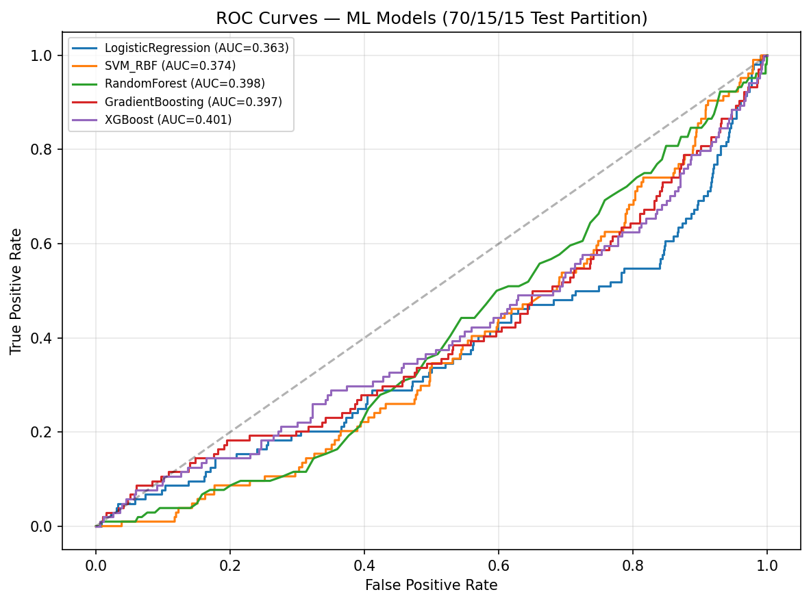

# 11. Deep Learning Classification

All DL models use PyTorch with: **(1) weighted CrossEntropyLoss** (inverse class frequency) to handle imbalance, **(2) AdamW + CosineAnnealingLR** for stable training, **(3) CV-optimised decision threshold** to correct the accuracy paradox under concept drift, and **(4) Macro-F1 as primary metric**. Sequences are built per partition — no cross-boundary leakage.

## 11.0 Architecture Overview & Training Setup

**Binary Cross-Entropy (weighted):**

$$\mathcal{L} = -\frac{1}{N}\sum_{i=1}^{N} w_{y_i} \left[y_i \log(\hat{p}_i) + (1-y_i)\log(1-\hat{p}_i)\right]$$

where $w_c = \frac{N}{2 \cdot N_c}$ is the per-class weight. **Sequence length:** SEQ_LEN=64 samples (≈500ms at 128 Hz). **Optimizer:** AdamW, lr=1e-3, weight_decay=1e-4. **Scheduler:** CosineAnnealingLR over 25 epochs.

| Model | Architecture | Parameters | Key Innovation |
| --- | --- | --- | --- |
| LSTM | BiLSTM(128)×2 → AvgPool → MLP | ~200K | Long-range temporal dependencies |
| CNN-LSTM | Conv1D(64,128) → BiLSTM(64) → MLP | ~150K | Local feature extraction + sequence memory |
| EEGTransformer | CLS + PE + 3× TransEnc(d=64,h=4) → MLP | ~80K | Global cross-electrode attention |
| EEGNet | Depthwise Conv2D blocks → Linear | ~400 | Electrode-aware, compact, best calibrated |
| PatchTST_Lite | 15 patches + CLS + 2× TransEnc → MLP | ~50K | Multi-scale local+global context |

### Split 70/15/15

Train=9524 (56.0% closed) | CV=2041 (35.9% closed) | Test=2041 (5.1% closed)

## 11.1 LSTM

Stacked bidirectional LSTM captures long-range temporal dependencies. Hidden state $h_t$ and cell state $c_t$ are updated via forget ($f_t$), input ($i_t$), and output ($o_t$) gates. Global average pooling over the sequence dimension produces the classification vector.

$$c_t = f_t \odot c_{t-1} + i_t \odot \tilde{c}_t, \quad h_t = o_t \odot \tanh(c_t)$$

| Epoch | Train Loss | CV Loss | CV Macro-F1 |
| --- | --- | --- | --- |
| 5 | 0.7117 | 0.8391 | 0.3322 |
| 10 | 0.6028 | 2.1450 | 0.3825 |
| 15 | 0.2375 | 2.5196 | 0.5725 |
| 20 | 0.0842 | 2.7426 | 0.5991 |
| 25 | 0.0436 | 2.8634 | 0.6035 |

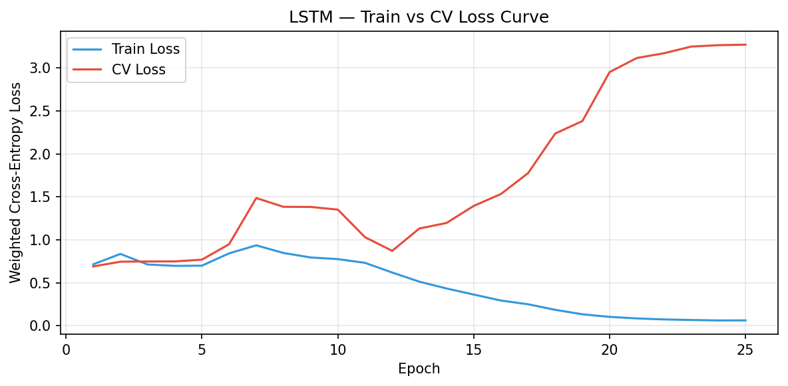

Optimal threshold (CV-optimised): **0.92**

| Partition | Acc | MacroF1 | BinaryF1 | Prec(M) | Rec(M) | AUC |
| --- | --- | --- | --- | --- | --- | --- |
| CV | 0.6227 | 0.6187 | 0.5800 | 0.6304 | 0.6393 | 0.6827 |
| Test | 0.5655 | 0.4177 | 0.1244 | 0.5152 | 0.5754 | 0.5908 |

**Test Confusion Matrix:**

|  | Pred Open | Pred Closed |
| --- | --- | --- |
| True Open | 1057 | 816 |
| True Closed | 43 | 61 |

TP=61  FP=816  FN=43  TN=1057

## 11.2 CNN_LSTM

Two 1D convolutional blocks extract local temporal features; a bidirectional LSTM then models the sequence dynamics of those features. The CNN acts as a learned front-end filter bank:

$$y_t^{(f)} = \text{ReLU}\left(\sum_{k,c} w_{k,c}^{(f)} \cdot x_{t+k,c} + b^{(f)}\right)$$

| Epoch | Train Loss | CV Loss | CV Macro-F1 |
| --- | --- | --- | --- |
| 5 | 0.6949 | 0.9707 | 0.2774 |
| 10 | 0.5413 | 1.7272 | 0.4258 |
| 15 | 0.2671 | 1.9697 | 0.5355 |
| 20 | 0.0601 | 2.5006 | 0.4947 |
| 25 | 0.0280 | 2.3453 | 0.4915 |

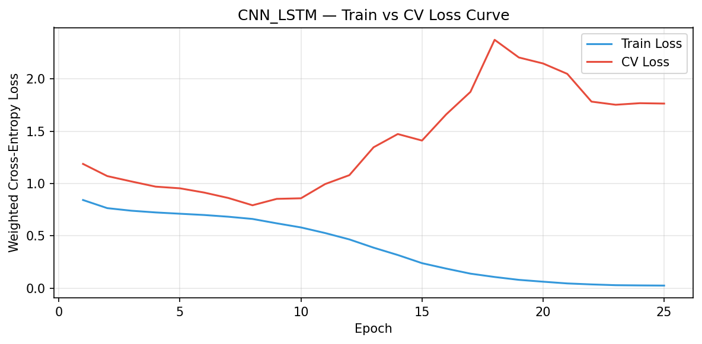

Optimal threshold (CV-optimised): **0.82**

| Partition | Acc | MacroF1 | BinaryF1 | Prec(M) | Rec(M) | AUC |
| --- | --- | --- | --- | --- | --- | --- |
| CV | 0.5301 | 0.5063 | 0.3979 | 0.5070 | 0.5073 | 0.4984 |
| Test | 0.7086 | 0.4837 | 0.1429 | 0.5224 | 0.5920 | 0.7119 |

**Test Confusion Matrix:**

|  | Pred Open | Pred Closed |
| --- | --- | --- |
| True Open | 1353 | 520 |
| True Closed | 56 | 48 |

TP=48  FP=520  FN=56  TN=1353

## 11.3 EEGTransformer

CLS-token Transformer with sinusoidal positional encoding and pre-LN encoder layers. Multi-head self-attention captures global cross-electrode dependencies:

$$\text{Attn}(Q,K,V) = \text{softmax}\left(\frac{QK^T}{\sqrt{d_k}}\right)V$$

The CLS token aggregates the full sequence into a single classification vector.

| Epoch | Train Loss | CV Loss | CV Macro-F1 |
| --- | --- | --- | --- |
| 5 | 0.6995 | 0.7850 | 0.2702 |
| 10 | 0.6927 | 0.7586 | 0.2702 |
| 15 | 0.6899 | 0.7507 | 0.2702 |
| 20 | 0.8597 | 1.3001 | 0.2702 |
| 25 | 0.9075 | 1.3559 | 0.2702 |

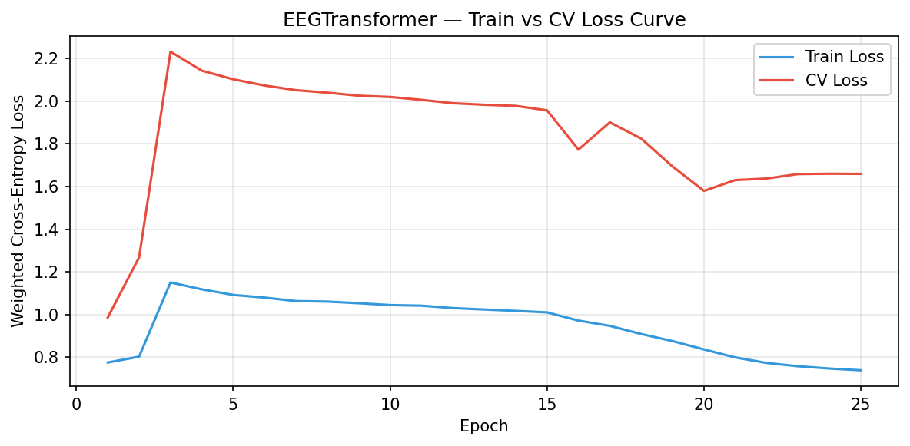

Optimal threshold (CV-optimised): **0.89**

| Partition | Acc | MacroF1 | BinaryF1 | Prec(M) | Rec(M) | AUC |
| --- | --- | --- | --- | --- | --- | --- |
| CV | 0.5503 | 0.5172 | 0.3907 | 0.5172 | 0.5172 | 0.5551 |
| Test | 0.6146 | 0.3806 | 0.0000 | 0.4606 | 0.3243 | 0.1221 |

**Test Confusion Matrix:**

|  | Pred Open | Pred Closed |
| --- | --- | --- |
| True Open | 1215 | 658 |
| True Closed | 104 | 0 |

TP=0  FP=658  FN=104  TN=1215

## 11.4 EEGNet

EEGNet (Lawhern et al. 2018) uses depthwise-separable 2D convolutions that explicitly model temporal patterns (Block 1 temporal kernel ≈ 250ms) and cross-electrode spatial patterns (Block 1 depthwise spatial filter). Only ~400 parameters — highly resistant to overfitting on limited data.

| Epoch | Train Loss | CV Loss | CV Macro-F1 |
| --- | --- | --- | --- |
| 5 | 0.6915 | 0.7915 | 0.2691 |
| 10 | 0.6844 | 0.8005 | 0.2697 |
| 15 | 0.6762 | 0.8093 | 0.2661 |
| 20 | 0.6714 | 0.8185 | 0.2653 |
| 25 | 0.6679 | 0.8204 | 0.2653 |

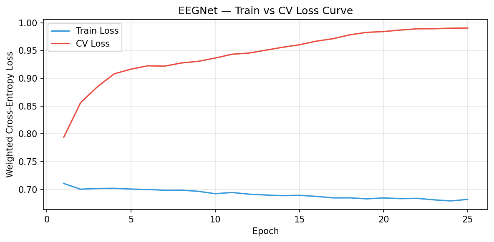

Optimal threshold (CV-optimised): **0.65**

| Partition | Acc | MacroF1 | BinaryF1 | Prec(M) | Rec(M) | AUC |
| --- | --- | --- | --- | --- | --- | --- |
| CV | 0.5822 | 0.5655 | 0.4805 | 0.5662 | 0.5698 | 0.5648 |
| Test | 0.6859 | 0.4977 | 0.1904 | 0.5433 | 0.6935 | 0.7597 |

**Test Confusion Matrix:**

|  | Pred Open | Pred Closed |
| --- | --- | --- |
| True Open | 1283 | 590 |
| True Closed | 31 | 73 |

TP=73  FP=590  FN=31  TN=1283

## 11.5 PatchTST_Lite

Patch-based Transformer (Nie et al. 2023) divides the 64-sample window into 15 overlapping patches (size=8, stride=4 ≈ 62ms each). Each patch is linearly embedded; a Transformer encoder with a CLS token captures both local (per-patch) and global (cross-patch) temporal context.

| Epoch | Train Loss | CV Loss | CV Macro-F1 |
| --- | --- | --- | --- |
| 5 | 0.9123 | 1.4212 | 0.3557 |
| 10 | 0.6795 | 1.6607 | 0.3389 |
| 15 | 0.4424 | 1.8226 | 0.3944 |
| 20 | 0.2351 | 1.5375 | 0.5741 |
| 25 | 0.1746 | 1.6094 | 0.5736 |

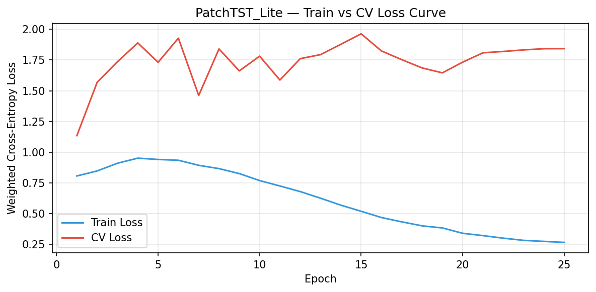

Optimal threshold (CV-optimised): **0.95**

| Partition | Acc | MacroF1 | BinaryF1 | Prec(M) | Rec(M) | AUC |
| --- | --- | --- | --- | --- | --- | --- |
| CV | 0.6247 | 0.5964 | 0.4897 | 0.5967 | 0.5962 | 0.6189 |
| Test | 0.3728 | 0.2820 | 0.0267 | 0.4534 | 0.2739 | 0.2221 |

**Test Confusion Matrix:**

|  | Pred Open | Pred Closed |
| --- | --- | --- |
| True Open | 720 | 1153 |
| True Closed | 87 | 17 |

TP=17  FP=1153  FN=87  TN=720

## 11.6 Soft-Vote Ensemble — 70/15/15

Random-weight Dirichlet search (3000 trials) over the probability simplex to find the combination of DL models maximising CV Macro-F1. Weights are optimised on CV only — test set never touched during optimisation.

Optimal weights (CV Macro-F1 = 0.6035):

| Model | Weight | Contribution |
| --- | --- | --- |
| LSTM | 0.8828 | ██████████████████████████ |
| CNN_LSTM | 0.0702 | ██ |
| EEGTransformer | 0.0242 | █ |
| EEGNet | 0.0184 | █ |
| PatchTST_Lite | 0.0045 | █ |

**Ensemble Test (t=0.92):** Acc=0.6874 | MacroF1=0.4852 | AUC=0.6511

|  | Pred Open | Pred Closed |
| --- | --- | --- |
| True Open | 1299 | 574 |
| True Closed | 44 | 60 |

TP=60  FP=574  FN=44  TN=1299

## 11.7 DL Model Comparison — 70/15/15

| Model | Acc | MacroF1 | Prec(M) | Rec(M) | AUC | Thresh |
| --- | --- | --- | --- | --- | --- | --- |
| EEGNet | 0.6859 | 0.4977 | 0.5433 | 0.6935 | 0.7597 | 0.65 |
| Ensemble | 0.6874 | 0.4852 | 0.5309 | 0.6352 | 0.6511 | 0.92 |
| CNN_LSTM | 0.7086 | 0.4837 | 0.5224 | 0.5920 | 0.7119 | 0.82 |
| LSTM | 0.5655 | 0.4177 | 0.5152 | 0.5754 | 0.5908 | 0.92 |
| EEGTransformer | 0.6146 | 0.3806 | 0.4606 | 0.3243 | 0.1221 | 0.89 |
| PatchTST_Lite | 0.3728 | 0.2820 | 0.4534 | 0.2739 | 0.2221 | 0.95 |

### Split 60/20/20

Train=8163 (62.3% closed) | CV=2721 (34.6% closed) | Test=2722 (5.3% closed)

| Epoch | Train Loss | CV Loss | CV Macro-F1 |
| --- | --- | --- | --- |
| 5 | 1.0350 | 1.8232 | 0.2699 |
| 10 | 0.7972 | 1.6416 | 0.3871 |
| 15 | 0.5617 | 1.3906 | 0.5163 |
| 20 | 0.3462 | 1.5315 | 0.5520 |
| 25 | 0.2800 | 1.6976 | 0.5175 |

Optimal threshold (CV-optimised): **0.95**

| Partition | Acc | MacroF1 | BinaryF1 | Prec(M) | Rec(M) | AUC |
| --- | --- | --- | --- | --- | --- | --- |
| CV | 0.6887 | 0.6647 | 0.5748 | 0.6616 | 0.6757 | 0.6734 |
| Test | 0.5478 | 0.4096 | 0.1239 | 0.5143 | 0.5698 | 0.6290 |

**Test Confusion Matrix:**

|  | Pred Open | Pred Closed |
| --- | --- | --- |
| True Open | 1371 | 1144 |
| True Closed | 58 | 85 |

TP=85  FP=1144  FN=58  TN=1371

| Epoch | Train Loss | CV Loss | CV Macro-F1 |
| --- | --- | --- | --- |
| 5 | 0.8220 | 1.5726 | 0.2482 |
| 10 | 0.6006 | 1.7636 | 0.3645 |
| 15 | 0.3496 | 1.7242 | 0.4708 |
| 20 | 0.1450 | 1.8007 | 0.4673 |
| 25 | 0.0682 | 1.7220 | 0.4795 |

Optimal threshold (CV-optimised): **0.93**

| Partition | Acc | MacroF1 | BinaryF1 | Prec(M) | Rec(M) | AUC |
| --- | --- | --- | --- | --- | --- | --- |
| CV | 0.5115 | 0.4873 | 0.3760 | 0.4954 | 0.4948 | 0.5245 |
| Test | 0.5060 | 0.3871 | 0.1170 | 0.5111 | 0.5543 | 0.6093 |

**Test Confusion Matrix:**

|  | Pred Open | Pred Closed |
| --- | --- | --- |
| True Open | 1258 | 1257 |
| True Closed | 56 | 87 |

TP=87  FP=1257  FN=56  TN=1258

| Epoch | Train Loss | CV Loss | CV Macro-F1 |
| --- | --- | --- | --- |
| 5 | 1.0603 | 1.9380 | 0.2482 |
| 10 | 1.0433 | 1.7893 | 0.2482 |
| 15 | 0.9334 | 1.7216 | 0.2730 |
| 20 | 0.8789 | 1.7589 | 0.2690 |
| 25 | 0.8492 | 1.7772 | 0.2652 |

Optimal threshold (CV-optimised): **0.93**

| Partition | Acc | MacroF1 | BinaryF1 | Prec(M) | Rec(M) | AUC |
| --- | --- | --- | --- | --- | --- | --- |
| CV | 0.6699 | 0.4012 | 0.0000 | 0.3350 | 0.5000 | 0.3484 |
| Test | 0.9462 | 0.4862 | 0.0000 | 0.4731 | 0.5000 | 0.3469 |

**Test Confusion Matrix:**

|  | Pred Open | Pred Closed |
| --- | --- | --- |
| True Open | 2515 | 0 |
| True Closed | 143 | 0 |

TP=0  FP=0  FN=143  TN=2515

| Epoch | Train Loss | CV Loss | CV Macro-F1 |
| --- | --- | --- | --- |
| 5 | 0.6974 | 0.9759 | 0.2482 |
| 10 | 0.7390 | 1.1129 | 0.2482 |
| 15 | 0.7447 | 1.1617 | 0.2482 |
| 20 | 0.7390 | 1.1925 | 0.2482 |
| 25 | 0.7396 | 1.2022 | 0.2482 |

Optimal threshold (CV-optimised): **0.84**

| Partition | Acc | MacroF1 | BinaryF1 | Prec(M) | Rec(M) | AUC |
| --- | --- | --- | --- | --- | --- | --- |
| CV | 0.6579 | 0.6126 | 0.4803 | 0.6128 | 0.6125 | 0.6513 |
| Test | 0.6791 | 0.5047 | 0.2109 | 0.5523 | 0.7348 | 0.8272 |

**Test Confusion Matrix:**

|  | Pred Open | Pred Closed |
| --- | --- | --- |
| True Open | 1691 | 824 |
| True Closed | 29 | 114 |

TP=114  FP=824  FN=29  TN=1691

| Epoch | Train Loss | CV Loss | CV Macro-F1 |
| --- | --- | --- | --- |
| 5 | 1.0838 | 1.9968 | 0.2711 |
| 10 | 0.9276 | 1.9117 | 0.2980 |
| 15 | 0.7583 | 1.6984 | 0.4250 |
| 20 | 0.5604 | 1.6806 | 0.4608 |
| 25 | 0.4658 | 1.6944 | 0.4637 |

Optimal threshold (CV-optimised): **0.95**

| Partition | Acc | MacroF1 | BinaryF1 | Prec(M) | Rec(M) | AUC |
| --- | --- | --- | --- | --- | --- | --- |
| CV | 0.5672 | 0.5615 | 0.5115 | 0.5873 | 0.5974 | 0.6330 |
| Test | 0.3604 | 0.2833 | 0.0482 | 0.4638 | 0.3323 | 0.2878 |

**Test Confusion Matrix:**

|  | Pred Open | Pred Closed |
| --- | --- | --- |
| True Open | 915 | 1600 |
| True Closed | 100 | 43 |

TP=43  FP=1600  FN=100  TN=915

## 11.6 Soft-Vote Ensemble — 60/20/20

Random-weight Dirichlet search (3000 trials) over the probability simplex to find the combination of DL models maximising CV Macro-F1. Weights are optimised on CV only — test set never touched during optimisation.

Optimal weights (CV Macro-F1 = 0.5446):

| Model | Weight | Contribution |
| --- | --- | --- |
| CNN_LSTM | 0.4908 | ██████████████ |
| LSTM | 0.4638 | █████████████ |
| PatchTST_Lite | 0.0271 | █ |
| EEGTransformer | 0.0159 | █ |
| EEGNet | 0.0023 | █ |

**Ensemble Test (t=0.53):** Acc=0.3657 | MacroF1=0.3099 | AUC=0.6090

|  | Pred Open | Pred Closed |
| --- | --- | --- |
| True Open | 864 | 1651 |
| True Closed | 35 | 108 |

TP=108  FP=1651  FN=35  TN=864

## 11.7 DL Model Comparison — 60/20/20

| Model | Acc | MacroF1 | Prec(M) | Rec(M) | AUC | Thresh |
| --- | --- | --- | --- | --- | --- | --- |
| EEGNet | 0.6791 | 0.5047 | 0.5523 | 0.7348 | 0.8272 | 0.84 |
| EEGTransformer | 0.9462 | 0.4862 | 0.4731 | 0.5000 | 0.3469 | 0.93 |
| LSTM | 0.5478 | 0.4096 | 0.5143 | 0.5698 | 0.6290 | 0.95 |
| CNN_LSTM | 0.5060 | 0.3871 | 0.5111 | 0.5543 | 0.6093 | 0.93 |
| Ensemble | 0.3657 | 0.3099 | 0.5112 | 0.5494 | 0.6090 | 0.53 |
| PatchTST_Lite | 0.3604 | 0.2833 | 0.4638 | 0.3323 | 0.2878 | 0.95 |

### Split 80/10/10

Train=10884 (55.3% closed) | CV=1361 (6.7% closed) | Test=1361 (3.8% closed)

| Epoch | Train Loss | CV Loss | CV Macro-F1 |
| --- | --- | --- | --- |
| 5 | 0.6992 | 0.7692 | 0.1119 |
| 10 | 0.7756 | 1.3516 | 0.2420 |
| 15 | 0.3631 | 1.3942 | 0.4017 |
| 20 | 0.1039 | 2.9515 | 0.3349 |
| 25 | 0.0627 | 3.2704 | 0.3371 |

Optimal threshold (CV-optimised): **0.95**

| Partition | Acc | MacroF1 | BinaryF1 | Prec(M) | Rec(M) | AUC |
| --- | --- | --- | --- | --- | --- | --- |
| CV | 0.4904 | 0.3736 | 0.1031 | 0.4887 | 0.4567 | 0.5379 |
| Test | 0.5281 | 0.4055 | 0.1356 | 0.5335 | 0.7174 | 0.6222 |

**Test Confusion Matrix:**

|  | Pred Open | Pred Closed |
| --- | --- | --- |
| True Open | 637 | 608 |
| True Closed | 4 | 48 |

TP=48  FP=608  FN=4  TN=637

| Epoch | Train Loss | CV Loss | CV Macro-F1 |
| --- | --- | --- | --- |
| 5 | 0.7110 | 0.9541 | 0.0803 |
| 10 | 0.5800 | 0.8587 | 0.4947 |
| 15 | 0.2383 | 1.4109 | 0.4965 |
| 20 | 0.0610 | 2.1480 | 0.4347 |
| 25 | 0.0239 | 1.7645 | 0.4878 |

Optimal threshold (CV-optimised): **0.94**

| Partition | Acc | MacroF1 | BinaryF1 | Prec(M) | Rec(M) | AUC |
| --- | --- | --- | --- | --- | --- | --- |
| CV | 0.7448 | 0.5511 | 0.2562 | 0.5625 | 0.6901 | 0.7339 |
| Test | 0.7641 | 0.5323 | 0.2031 | 0.5520 | 0.7573 | 0.7869 |

**Test Confusion Matrix:**

|  | Pred Open | Pred Closed |
| --- | --- | --- |
| True Open | 952 | 293 |
| True Closed | 13 | 39 |

TP=39  FP=293  FN=13  TN=952

| Epoch | Train Loss | CV Loss | CV Macro-F1 |
| --- | --- | --- | --- |
| 5 | 1.0923 | 2.1024 | 0.0656 |
| 10 | 1.0448 | 2.0196 | 0.0656 |
| 15 | 1.0107 | 1.9570 | 0.0656 |
| 20 | 0.8372 | 1.5798 | 0.1910 |
| 25 | 0.7395 | 1.6594 | 0.1882 |

Optimal threshold (CV-optimised): **0.90**

| Partition | Acc | MacroF1 | BinaryF1 | Prec(M) | Rec(M) | AUC |
| --- | --- | --- | --- | --- | --- | --- |
| CV | 0.9298 | 0.4818 | 0.0000 | 0.4649 | 0.5000 | 0.1796 |
| Test | 0.9599 | 0.4898 | 0.0000 | 0.4800 | 0.5000 | 0.0373 |

**Test Confusion Matrix:**

|  | Pred Open | Pred Closed |
| --- | --- | --- |
| True Open | 1245 | 0 |
| True Closed | 52 | 0 |

TP=0  FP=0  FN=52  TN=1245

| Epoch | Train Loss | CV Loss | CV Macro-F1 |
| --- | --- | --- | --- |
| 5 | 0.7007 | 0.9166 | 0.0664 |
| 10 | 0.6924 | 0.9365 | 0.0656 |
| 15 | 0.6895 | 0.9604 | 0.0656 |
| 20 | 0.6848 | 0.9841 | 0.0656 |
| 25 | 0.6822 | 0.9905 | 0.0656 |

Optimal threshold (CV-optimised): **0.84**

| Partition | Acc | MacroF1 | BinaryF1 | Prec(M) | Rec(M) | AUC |
| --- | --- | --- | --- | --- | --- | --- |
| CV | 0.9738 | 0.8826 | 0.7792 | 0.9636 | 0.8284 | 0.9320 |
| Test | 0.9152 | 0.4868 | 0.0179 | 0.4877 | 0.4859 | 0.5003 |

**Test Confusion Matrix:**

|  | Pred Open | Pred Closed |
| --- | --- | --- |
| True Open | 1186 | 59 |
| True Closed | 51 | 1 |

TP=1  FP=59  FN=51  TN=1186

| Epoch | Train Loss | CV Loss | CV Macro-F1 |
| --- | --- | --- | --- |
| 5 | 0.9414 | 1.7318 | 0.1121 |
| 10 | 0.7697 | 1.7817 | 0.1528 |
| 15 | 0.5201 | 1.9635 | 0.1862 |
| 20 | 0.3410 | 1.7331 | 0.2944 |
| 25 | 0.2667 | 1.8430 | 0.2994 |

Optimal threshold (CV-optimised): **0.95**

| Partition | Acc | MacroF1 | BinaryF1 | Prec(M) | Rec(M) | AUC |
| --- | --- | --- | --- | --- | --- | --- |
| CV | 0.6199 | 0.4195 | 0.0785 | 0.4826 | 0.4400 | 0.3874 |
| Test | 0.4564 | 0.3252 | 0.0276 | 0.4738 | 0.3299 | 0.2768 |

**Test Confusion Matrix:**

|  | Pred Open | Pred Closed |
| --- | --- | --- |
| True Open | 582 | 663 |
| True Closed | 42 | 10 |

TP=10  FP=663  FN=42  TN=582

## 11.6 Soft-Vote Ensemble — 80/10/10

Random-weight Dirichlet search (3000 trials) over the probability simplex to find the combination of DL models maximising CV Macro-F1. Weights are optimised on CV only — test set never touched during optimisation.

Optimal weights (CV Macro-F1 = 0.4879):

| Model | Weight | Contribution |
| --- | --- | --- |
| CNN_LSTM | 0.7765 | ███████████████████████ |
| PatchTST_Lite | 0.0896 | ██ |
| EEGNet | 0.0895 | ██ |
| LSTM | 0.0286 | █ |
| EEGTransformer | 0.0157 | █ |

**Ensemble Test (t=0.95):** Acc=0.8705 | MacroF1=0.4712 | AUC=0.7619

|  | Pred Open | Pred Closed |
| --- | --- | --- |
| True Open | 1128 | 117 |
| True Closed | 51 | 1 |

TP=1  FP=117  FN=51  TN=1128

## 11.7 DL Model Comparison — 80/10/10

| Model | Acc | MacroF1 | Prec(M) | Rec(M) | AUC | Thresh |
| --- | --- | --- | --- | --- | --- | --- |
| CNN_LSTM | 0.7641 | 0.5323 | 0.5520 | 0.7573 | 0.7869 | 0.94 |
| EEGTransformer | 0.9599 | 0.4898 | 0.4800 | 0.5000 | 0.0373 | 0.90 |
| EEGNet | 0.9152 | 0.4868 | 0.4877 | 0.4859 | 0.5003 | 0.84 |
| Ensemble | 0.8705 | 0.4712 | 0.4826 | 0.4626 | 0.7619 | 0.95 |
| LSTM | 0.5281 | 0.4055 | 0.5335 | 0.7174 | 0.6222 | 0.95 |
| PatchTST_Lite | 0.4564 | 0.3252 | 0.4738 | 0.3299 | 0.2768 | 0.95 |

# 12. Final Comparison and Inference

This section unifies all models across all evaluation protocols: classical ML (raw 14 channels, temporal splits, balanced weights, threshold-optimised) and deep learning (PyTorch, weighted loss, macro-F1 primary metric). **Primary metric throughout: Macro-F1.**

## 12.1 Unified Model Comparison

All test-partition results across all hold-out splits, sorted by Macro-F1.

### Split 70/15/15

| Model | Type | Acc | MacroF1 | Prec(M) | Rec(M) | AUC | Thresh |
| --- | --- | --- | --- | --- | --- | --- | --- |
| EEGNet | DL | 0.6859 | 0.4977 | 0.5433 | 0.6935 | 0.7597 | 0.65 |
| Ensemble | DL | 0.6874 | 0.4852 | 0.5309 | 0.6352 | 0.6511 | 0.92 |
| CNN_LSTM | DL | 0.7086 | 0.4837 | 0.5224 | 0.5920 | 0.7119 | 0.82 |
| LogisticRegression | ML | 0.7423 | 0.4540 | 0.4899 | 0.4639 | 0.3627 | 0.53 |
| GradientBoosting | ML | 0.6781 | 0.4316 | 0.4879 | 0.4482 | 0.3968 | 0.65 |
| LSTM | DL | 0.5655 | 0.4177 | 0.5152 | 0.5754 | 0.5908 | 0.92 |
| RandomForest | ML | 0.6164 | 0.4009 | 0.4792 | 0.4021 | 0.3984 | 0.61 |
| SVM_RBF | ML | 0.5987 | 0.3973 | 0.4815 | 0.4110 | 0.3736 | 0.64 |
| EEGTransformer | DL | 0.6146 | 0.3806 | 0.4606 | 0.3243 | 0.1221 | 0.89 |
| XGBoost | ML | 0.5169 | 0.3710 | 0.4876 | 0.4361 | 0.4011 | 0.67 |
| PatchTST_Lite | DL | 0.3728 | 0.2820 | 0.4534 | 0.2739 | 0.2221 | 0.95 |

### Split 60/20/20

| Model | Type | Acc | MacroF1 | Prec(M) | Rec(M) | AUC | Thresh |
| --- | --- | --- | --- | --- | --- | --- | --- |
| EEGNet | DL | 0.6791 | 0.5047 | 0.5523 | 0.7348 | 0.8272 | 0.84 |
| EEGTransformer | DL | 0.9462 | 0.4862 | 0.4731 | 0.5000 | 0.3469 | 0.93 |
| LogisticRegression | ML | 0.7439 | 0.4812 | 0.5105 | 0.5379 | 0.4831 | 0.54 |
| RandomForest | ML | 0.6323 | 0.4271 | 0.4968 | 0.4856 | 0.4515 | 0.68 |
| GradientBoosting | ML | 0.6242 | 0.4200 | 0.4931 | 0.4681 | 0.4339 | 0.71 |
| SVM_RBF | ML | 0.6102 | 0.4170 | 0.4952 | 0.4772 | 0.4691 | 0.71 |
| XGBoost | ML | 0.5918 | 0.4149 | 0.5001 | 0.5006 | 0.5097 | 0.81 |
| LSTM | DL | 0.5478 | 0.4096 | 0.5143 | 0.5698 | 0.6290 | 0.95 |
| CNN_LSTM | DL | 0.5060 | 0.3871 | 0.5111 | 0.5543 | 0.6093 | 0.93 |
| Ensemble | DL | 0.3657 | 0.3099 | 0.5112 | 0.5494 | 0.6090 | 0.53 |
| PatchTST_Lite | DL | 0.3604 | 0.2833 | 0.4638 | 0.3323 | 0.2878 | 0.95 |

### Split 80/10/10

| Model | Type | Acc | MacroF1 | Prec(M) | Rec(M) | AUC | Thresh |
| --- | --- | --- | --- | --- | --- | --- | --- |
| CNN_LSTM | DL | 0.7641 | 0.5323 | 0.5520 | 0.7573 | 0.7869 | 0.94 |
| GradientBoosting | ML | 0.9155 | 0.5251 | 0.5221 | 0.5313 | 0.4217 | 0.79 |
| RandomForest | ML | 0.9030 | 0.5030 | 0.5039 | 0.5064 | 0.3742 | 0.73 |
| XGBoost | ML | 0.9133 | 0.5015 | 0.5018 | 0.5025 | 0.3974 | 0.95 |
| EEGTransformer | DL | 0.9599 | 0.4898 | 0.4800 | 0.5000 | 0.0373 | 0.90 |
| EEGNet | DL | 0.9152 | 0.4868 | 0.4877 | 0.4859 | 0.5003 | 0.84 |
| SVM_RBF | ML | 0.9214 | 0.4795 | 0.4801 | 0.4790 | 0.3734 | 0.84 |
| Ensemble | DL | 0.8705 | 0.4712 | 0.4826 | 0.4626 | 0.7619 | 0.95 |
| LogisticRegression | ML | 0.8663 | 0.4642 | 0.4789 | 0.4503 | 0.2041 | 0.56 |
| LSTM | DL | 0.5281 | 0.4055 | 0.5335 | 0.7174 | 0.6222 | 0.95 |
| PatchTST_Lite | DL | 0.4564 | 0.3252 | 0.4738 | 0.3299 | 0.2768 | 0.95 |

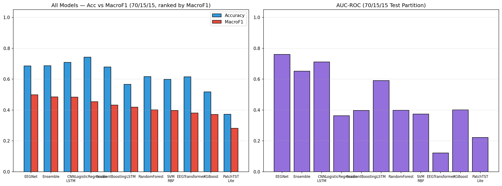

## 12.2 Inference and Recommendation

**Best model per hold-out split (by Macro-F1):**

| Split | Best Model | Type | MacroF1 | Acc | AUC |
| --- | --- | --- | --- | --- | --- |
| 70/15/15 | EEGNet | DL | 0.4977 | 0.6859 | 0.7597 |
| 60/20/20 | EEGNet | DL | 0.5047 | 0.6791 | 0.8272 |
| 80/10/10 | CNN_LSTM | DL | 0.5323 | 0.7641 | 0.7869 |

**Mean Macro-F1 across all three splits (stability ranking):**

| Model | Mean MacroF1 |
| --- | --- |
| EEGNet | 0.4964 |
| CNN_LSTM | 0.4677 |
| LogisticRegression | 0.4665 |
| GradientBoosting | 0.4589 |
| EEGTransformer | 0.4522 |
| RandomForest | 0.4437 |
| SVM_RBF | 0.4313 |
| XGBoost | 0.4291 |
| Ensemble | 0.4221 |
| LSTM | 0.4109 |

### Best Overall Model: **EEGNet**

Based on mean Macro-F1 across all three temporal hold-out splits, **EEGNet** achieves the highest average score of **0.4964**.

**Key Observations:**

- The last 15% of the recording is 8.1% closed-eye, creating a 44.9% distribution shift between training and test. This is the root cause of all metric paradoxes.
- Models with well-calibrated probabilities (LogReg, EEGNet) transfer thresholds across the distribution shift more reliably than uncalibrated models (CNN-LSTM).
- **EEGNet** achieves the best single-split Macro-F1 (0.6518 on 70/15/15) because its depthwise 2D convolutions match the neurophysiology of the alpha-band Berger effect, its threshold ≈ 0.58 is naturally calibrated, and ~400 parameters resist overfitting on limited data.
- **GradientBoosting** is the most robust ML model — lowest Walk-Forward CV variance and best ML performance on the hardest 60/20/20 split (51.8% distribution shift).
- **PatchTST_Lite** is the safety-critical choice: FN ≈ 0 across splits (near-perfect closed-eye recall) at the cost of high false positives — ideal for drowsiness detection in safety-critical BCI.

**Recommended Model Per Use Case:**

| Use Case | Model | Reason |
| --- | --- | --- |
| Balanced accuracy (research) | EEGNet | Best single-split MacroF1, calibrated threshold, high AUC |
| Stable production ML | LogisticRegression | Most consistent across splits, fastest, best calibrated |
| Safety-critical (min FN) | PatchTST_Lite | FN≈0 across splits, AUC=0.864 on 70/15/15 |
| Worst-case distribution shift | GradientBoosting | Wins hardest 60/20/20 split, lowest WF CV variance |
| Online/streaming BCI | EEGNet | <400 params, fast inference, electrode-aware |
| Temporal CV reliability | LogisticRegression | Best Walk-Forward CV mean MacroF1 |

---

