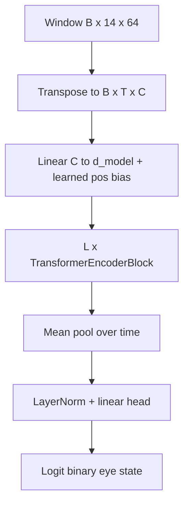

# EEGFormer (temporal Transformer)

EEGFormer here means a **lightweight EEG-specific Transformer baseline**: each time index is one token; the token embedding linearly maps all 14 channel amplitudes at that time step into `d_model`, then stacked time tokens pass through a standard `TransformerEncoder` (multi-head self-attention + FFN). This is inspired by Transformer-style EEG encoders in the literature; it is **trained from scratch** on this dataset (no external pretrained weights).

