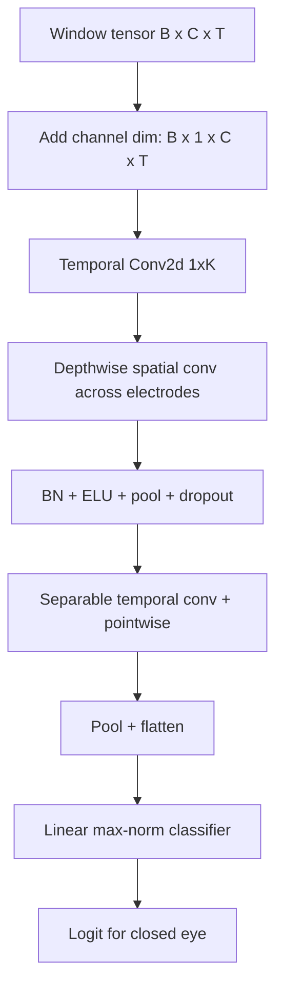

# EEGNet (deep learning branch)

Input shape per window: `(batch, 14 channels, 64 time samples)` after chronological split and windowing.

```mermaid
flowchart TD
  A[Window tensor B x C x T] --> B[Add channel dim: B x 1 x C x T]
  B --> C[Temporal Conv2d 1xK]
  C --> D[Depthwise spatial conv across electrodes]
  D --> E[BN + ELU + pool + dropout]
  E --> F[Separable temporal conv + pointwise]
  F --> G[Pool + flatten]
  G --> H[Linear max-norm classifier]
  H --> I[Logit for closed eye]
```
