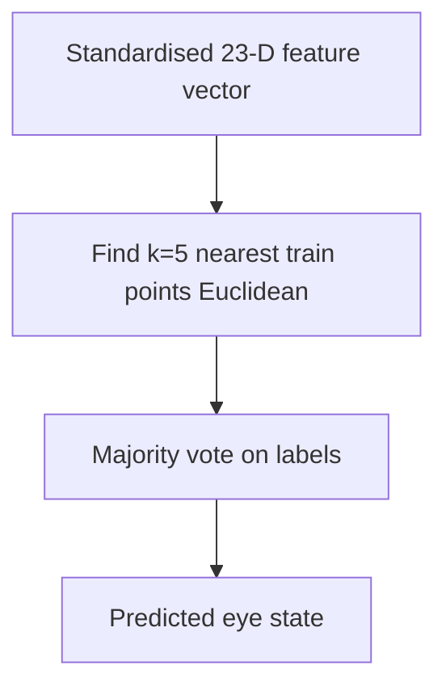

# k-nearest neighbors

```mermaid
flowchart TD
  A[Standardised 23-D feature vector] --> B[Find k=5 nearest train points Euclidean]
  B --> C[Majority vote on labels]
  C --> D[Predicted eye state]
```
