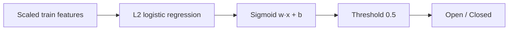

# Logistic regression (linear baseline)

```mermaid
flowchart LR
  A[Scaled train features] --> B[L2 logistic regression]
  B --> C[Sigmoid w·x + b]
  C --> D[Threshold 0.5]
  D --> E[Open / Closed]
```
