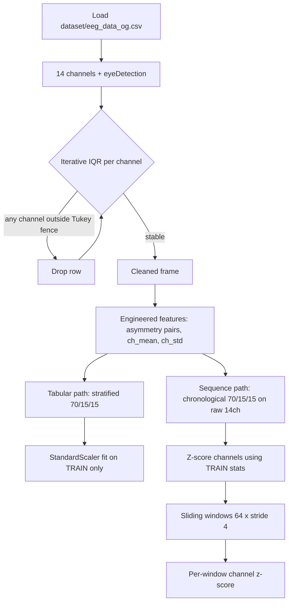

# Preprocessing pipeline (tabular + shared cleaning)

End-to-end flow from raw CSV to model-ready tensors / feature matrices.

```mermaid
flowchart TD
  A[Load dataset/eeg_data_og.csv] --> B[14 channels + eyeDetection]
  B --> C{Iterative IQR per channel}
  C -->|any channel outside Tukey fence| D[Drop row]
  D --> C
  C -->|stable| E[Cleaned frame]
  E --> F[Engineered features: asymmetry pairs, ch_mean, ch_std]
  F --> G[Tabular path: stratified 70/15/15]
  F --> H[Sequence path: chronological 70/15/15 on raw 14ch]
  G --> I[StandardScaler fit on TRAIN only]
  H --> J[Z-score channels using TRAIN stats]
  J --> K[Sliding windows 64 x stride 4]
  K --> L[Per-window channel z-score]
```
