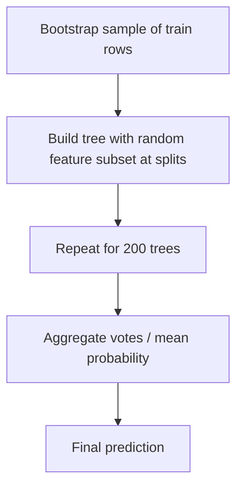

# Random forest

```mermaid
flowchart TD
  A[Bootstrap sample of train rows] --> B[Build tree with random feature subset at splits]
  B --> C[Repeat for 200 trees]
  C --> D[Aggregate votes / mean probability]
  D --> E[Final prediction]
```
