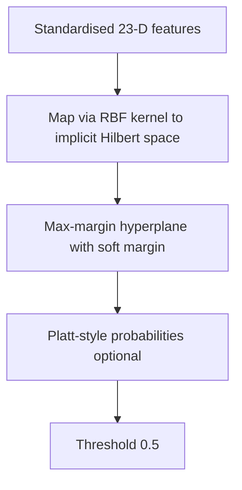

# Support vector machine (RBF kernel)

```mermaid
flowchart TD
  A[Standardised 23-D features] --> B[Map via RBF kernel to implicit Hilbert space]
  B --> C[Max-margin hyperplane with soft margin]
  C --> D[Platt-style probabilities optional]
  D --> E[Threshold 0.5]
```
